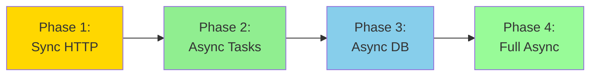

# ICICLE Insights Documentation

Welcome to the ICICLE Insights documentation! This project is a C++23 HTTP server that collects and stores metrics about ICICLE project components.

## Getting Started

1. **[Architecture](architecture.md)** - Start here to understand the overall system design
   - Error handling with `std::expected`
   - Database connection management
   - HTTP routing patterns
   - Background task scheduler architecture

## Core Guides

### Development Guides

- **[HTTP Client Management](http-client-guide.md)** - Implement efficient HTTP client caching
  - Why HTTP clients are expensive to create
  - Client caching by base URL
  - Thread-safe design for async operations
  - Proper SSL configuration
  - Migration path to async/await

- **[Background Tasks](background-tasks.md)** - Running periodic jobs without blocking
  - ASIO timer-based scheduling
  - Alternative approaches (threads, cron)
  - Non-blocking execution
  - Testing strategies

- **[Async Task Patterns](async-task-patterns.md)** - Advanced async programming with ASIO
  - Thread pools with `asio::post`
  - Structured task pipelines
  - C++20 coroutines
  - Migration path from sync to full async

- **[TLS Guide](tls-guide.md)** - SSL/TLS configuration
  - Certificate management
  - System vs custom CA certificates
  - Troubleshooting SSL errors

## Quick Reference

### Common Patterns

#### Error Handling
```cpp
std::expected<T, core::Error> doWork() {
  auto result = Database->get<Platform>(id);
  if (!result) {
    return std::unexpected(result.error());
  }
  return result.value();
}
```

#### HTTP Client Usage
```cpp
HttpClientManager Manager(Config);
auto Client = Manager.getClient("https://api.github.com");
auto Response = (*Client)->get("/users/octocat", Headers);
```

#### Background Tasks
```cpp
TaskScheduler Scheduler(Io, Database);
Scheduler.start(std::chrono::hours(24 * 14));  // Every 2 weeks
```

## Learning Path

If you're new to the codebase, follow this order:

1. **[Architecture](architecture.md)** - Understand core patterns
2. **[Background Tasks](background-tasks.md)** - See how periodic jobs work
3. **[HTTP Client Guide](http-client-guide.md)** - Learn efficient HTTP patterns
4. **[Async Task Patterns](async-task-patterns.md)** - Master async programming

## Development Workflow

### Building
```bash
just deps        # Install dependencies
just setup       # Configure CMake
just build       # Build project
just run         # Run server
```

### Testing
```bash
just test        # Run all tests
just test-unit   # Unit tests only
```

### Common Tasks

**Add a new API endpoint:**
1. Define models in `include/git/models.hpp`
2. Add DbTraits specialization
3. Create route handler in `src/git/router.cpp`
4. Register route in router setup

**Add background data collection:**
1. Implement task function in `src/git/tasks.cpp`
2. Use `HttpClientManager` for API calls
3. Return `std::expected<void, core::Error>`
4. Call from scheduler or API endpoint

**Add new platform (GitLab, Bitbucket, etc.):**
1. Create platform-specific models
2. Implement API client wrapper
3. Add scheduler for periodic updates
4. Cache HTTP client by base URL

## Code Style

- **Error handling**: `std::expected<T, core::Error>` (no exceptions)
- **Naming**: `PascalCase` for types, `lowerCamelCase` for functions
- **Headers**: `#pragma once`, minimal includes
- **Lifetimes**: `shared_ptr` for shared resources, references for parameters

## Architecture Decisions

Key design choices and their rationale:

| Decision | Rationale | See |
|----------|-----------|-----|
| `std::expected` over exceptions | Explicit errors, zero overhead | [Architecture](architecture.md#error-handling-with-stdexpectedt-e) |
| `shared_ptr<Database>` | Non-movable + shared handler access | [Architecture](architecture.md#database-connection-management) |
| HTTP client caching | Reuse connection pools (10x faster) | [HTTP Client Guide](http-client-guide.md) |
| ASIO timers for scheduling | Integrated lifecycle, non-blocking | [Background Tasks](background-tasks.md) |
| Thread pool for heavy tasks | Keep event loop responsive | [Async Patterns](async-task-patterns.md) |
| C++23 features | Modern idioms, better tooling | Everywhere! |

## Migration Paths

The codebase is designed for incremental migration to async:



**Current state:** Phase 1 (sync HTTP) with background tasks using thread pools

**Next step:** Add async database layer while maintaining sync HTTP handlers

**Goal:** Phase 4 - Fully async with coroutines everywhere

## Debugging Tips

### Common Issues

**SIGTRAP crash on HTTP client:**
- Check SSL certificate paths
- Don't `return` from SSL configuration lambdas
- Ensure client is cached and reused

**Database connection errors:**
- Verify `DATABASE_URL` environment variable
- Check PostgreSQL is running
- Test connection with `psql`

**Slow requests:**
- Check if background tasks are blocking event loop
- Use thread pool for heavy operations
- Profile with `spdlog` timing logs

### Logging

Set log level via environment:
```bash
LOG_LEVEL=debug just run  # Verbose logging
LOG_LEVEL=info just run   # Normal (default)
LOG_LEVEL=error just run  # Errors only
```

## Contributing

### Adding Documentation

- Keep guides focused on one topic
- Include code examples and diagrams
- Show both "bad" and "good" patterns
- Link to related guides
- Add entry to this README

### Code Reviews

Look for:
- Error handling with `std::expected`
- Efficient parameter passing (const ref for shared_ptr, strings)
- Thread safety for async operations
- Proper client caching
- No blocking in event loop

## External Resources

### C++23 Features
- [`std::expected` reference](https://en.cppreference.com/w/cpp/utility/expected)
- [C++20 coroutines](https://en.cppreference.com/w/cpp/language/coroutines)

### Libraries
- [Glaze (HTTP + JSON)](https://github.com/stephenberry/glaze)
- [ASIO](https://think-async.com/Asio/)
- [libpqxx (PostgreSQL)](https://pqxx.org/development/libpqxx/)
- [spdlog](https://github.com/gabime/spdlog)

### Async Programming
- [Asynchronous Programming with ASIO](https://think-async.com/Asio/asio-1.30.2/doc/asio/overview/core/async.html)
- [C++ Coroutines: Understanding the Compiler Transform](https://lewissbaker.github.io/2017/09/25/coroutine-theory)

## Questions?

Check existing guides first, then:
1. Search codebase for examples
2. Check library documentation
3. Ask in project chat/issues
