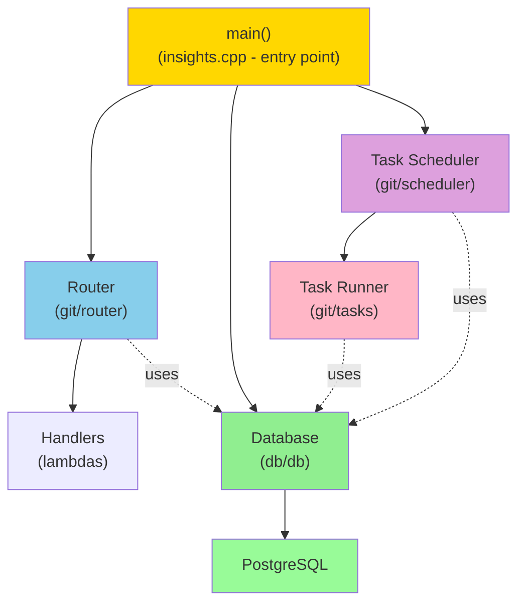
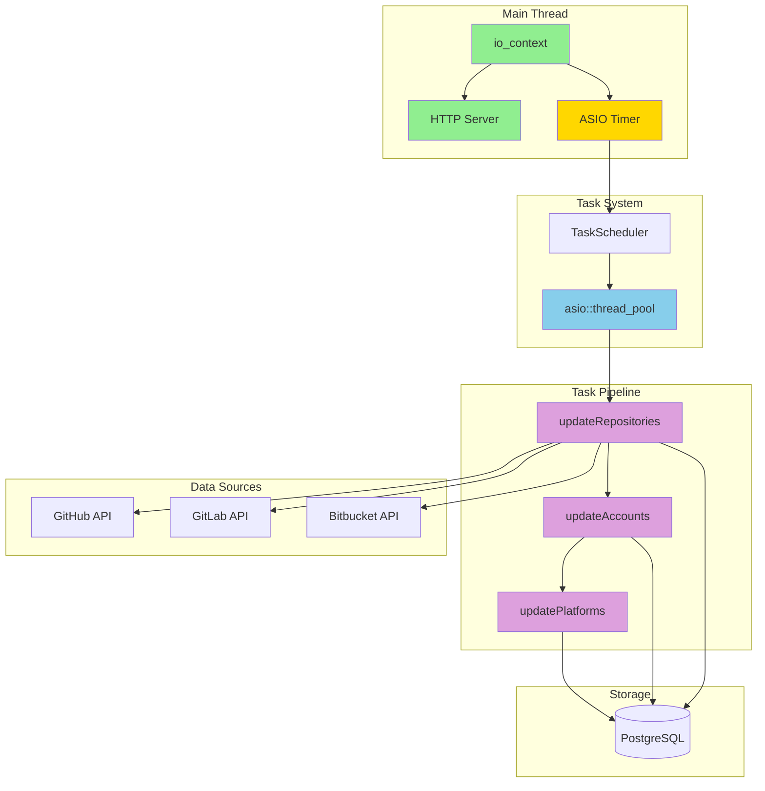
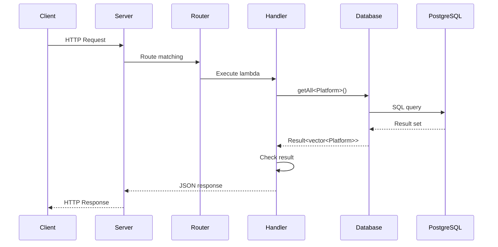
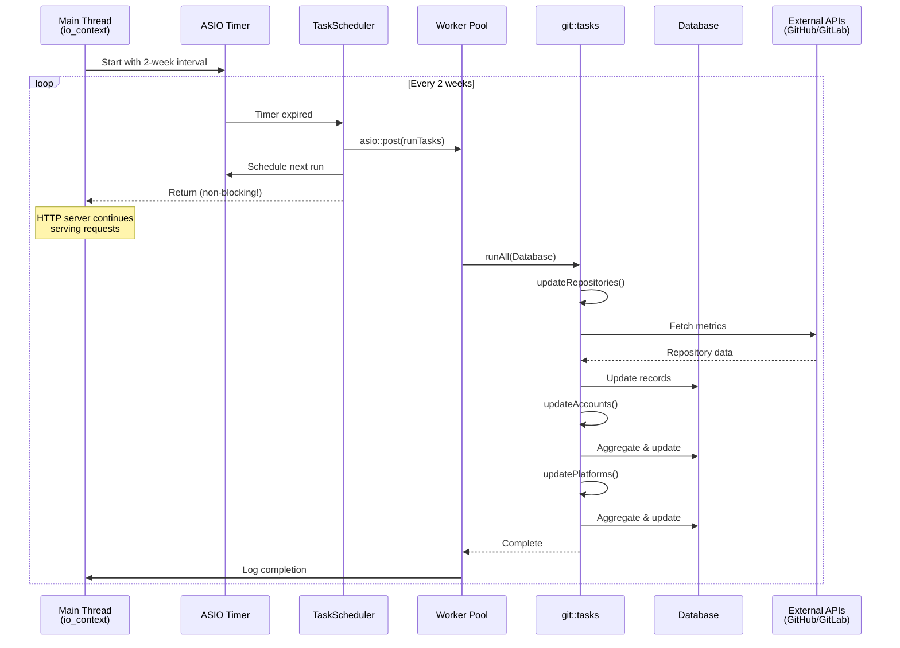
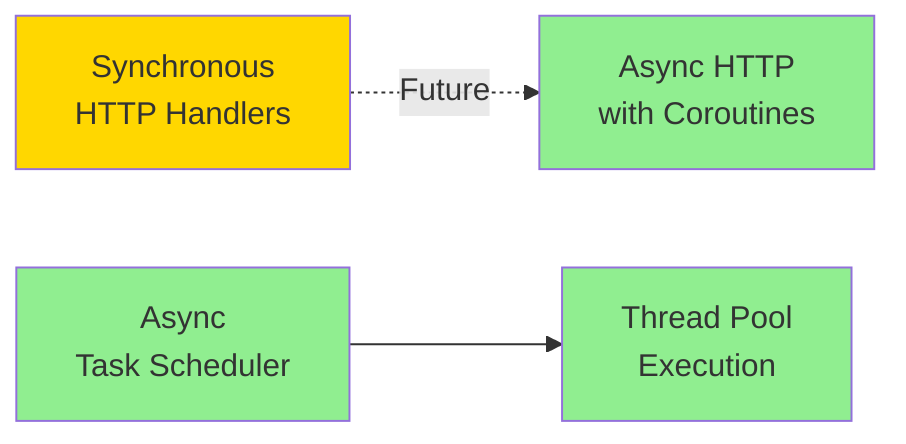

# ICICLE Insights Architecture

## Overview

ICICLE Insights is a C++23 HTTP server that collects metrics about ICICLE project components from Git platforms and container registries. The application follows a layered architecture with clear separation of concerns.



## Core Patterns

### Error Handling with `Result<T>`

The codebase uses C++23 `std::expected<T, Error>` for error handling instead of exceptions at API boundaries.

```cpp
// core/result.hpp
namespace insights::core {
  struct Error { std::string Message; };

  template<typename T>
  using Result = std::expected<T, Error>;
}
```

Usage pattern:
```cpp
auto result = Database->create(entity);
if (!result) {
    spdlog::error(result.error().Message);
    return;
}
auto entity = result.value();
```

This provides:
- Explicit error handling (can't ignore errors)
- No exception overhead in hot paths
- Clear function signatures showing fallibility

### Database Connection Management

The `Database` struct wraps a `pqxx::connection` for PostgreSQL access.

**Why `shared_ptr<Database>`?**

```cpp
static core::Result<std::shared_ptr<Database>> connect(const std::string &ConnString);
```

1. **Non-movable connection**: `pqxx::connection` cannot be moved or copied. Returning by value would require a move, which fails.

2. **Shared access**: Multiple HTTP route handlers (lambdas) need access to the same database connection:
   ```cpp
   Router.get("/platforms", [Database](...) { Database->getAll<Platform>(); });
   Router.post("/platforms", [Database](...) { Database->create(platform); });
   ```

3. **Lifetime safety**: `shared_ptr` ensures the Database lives as long as any handler needs it. The type system enforces this - no manual lifetime reasoning required.

**Alternative considered**: Reference capture `[&Database]` would work if the Database outlives all handlers, but requires manual lifetime management and is error-prone.

### HTTP Routing

Routes are registered as lambdas that capture the shared Database pointer:

```cpp
core::Result<void> registerPlatformRoutes(
    glz::http_router &Router,
    std::shared_ptr<db::Database>& Database
) {
    using enum core::HttpStatus;

    Router.get("/platforms", [Database](const glz::request &Request,
                                         glz::response &Response) {
        Response.status(static_cast<int>(Ok))
                .json(Database->getAll<git::models::Platform>());
    });

    return {};
}
```

Key points:
- Lambdas capture `Database` by value (copies the `shared_ptr`, not the Database)
- Each handler owns a reference count to the Database
- `HttpStatus` enum avoids magic numbers

### Generic Database Operations

The Database uses templates with a `DbEntity` concept and traits for type-safe CRUD:

```cpp
template <core::DbEntity T>
core::Result<T> create(const T &Entity);

template <core::DbEntity T>
core::Result<T> get(const std::string &Id);

template <core::DbEntity T>
core::Result<std::vector<T>> getAll();
```

Each entity type specializes `DbTraits<T>`:

```cpp
template <> struct DbTraits<git::models::Platform> {
    static constexpr std::string_view TableName = "git_platforms";
    static constexpr std::string_view Columns = "name, clones, ...";

    static auto toParams(const Platform &p) {
        return std::make_tuple(p.Name, p.Clones, ...);
    }

    static Platform fromRow(const pqxx::row &Row) { ... }
};
```

This provides:
- Type-safe database operations
- No SQL string building at call sites
- Compile-time table/column mapping

### Background Task Scheduler

The task scheduler runs periodic background jobs without blocking HTTP requests.

**Architecture:**



**Key Components:**

1. **TaskScheduler** (`git/scheduler.hpp`)
   - Manages ASIO `steady_timer` for periodic execution
   - Posts work to thread pool asynchronously
   - Configurable interval (default: 2 weeks)

2. **Task Pipeline** (`git/tasks.hpp`)
   - `updateRepositories()`: Fetch metrics from Git APIs
   - `updateAccounts()`: Aggregate repository data to accounts
   - `updatePlatforms()`: Aggregate account data to platforms
   - `runAll()`: Orchestrates the full pipeline

3. **Thread Pool** (`asio::thread_pool`)
   - Separate worker threads for heavy I/O
   - Prevents blocking the main event loop
   - Configurable pool size

**Execution Model:**

```cpp
// Pseudo-code of scheduler operation
void TaskScheduler::onTimerExpired() {
  // Post to thread pool - returns immediately
  asio::post(WorkerPool, [Database]() {
    // Runs on worker thread (non-blocking)
    tasks::runAll(*Database);
  });

  // Main thread continues immediately
  scheduleNext();  // Set next timer
}
```

**Non-Blocking Guarantee:**
- Timer callback returns in microseconds
- Heavy work (API calls, DB updates) runs on worker threads
- HTTP requests remain responsive during task execution

## Module Structure

```
include/
├── core/
│   ├── config.hpp      # Environment configuration
│   ├── http.hpp        # HTTP status codes enum
│   ├── result.hpp      # Result<T> type alias
│   └── traits.hpp      # DbEntity concept, DbTraits
├── db/
│   └── db.hpp          # Database struct and operations
├── git/
│   ├── models.hpp      # Platform, Account, Repository
│   ├── router.hpp      # Route registration
│   ├── tasks.hpp       # Background task pipeline
│   └── scheduler.hpp   # Periodic task scheduler
├── containers/
│   └── models.hpp      # Container registry models
└── server/
    └── server.hpp      # Server initialization

src/
├── insights.cpp        # Entry point
├── db/
│   └── db.cpp          # Database implementation
└── git/
    ├── router.cpp      # Route handlers
    ├── tasks.cpp       # Task implementations
    └── scheduler.cpp   # Scheduler implementation
```

## Data Model

Parallel hierarchies for Git and Container platforms:

```
Platform (GitHub, GitLab, DockerHub)
    └── Account (user or organization)
            └── Repository (individual repo/image)
```

Each level aggregates metrics:
- **Git**: stars, forks, clones, views, watchers, followers
- **Containers**: pulls, stars

## System Flows

### HTTP Request Flow



**Steps:**
1. HTTP request arrives at server
2. Router matches path to handler lambda
3. Lambda has captured `shared_ptr<Database>`
4. Handler calls Database methods (create, get, getAll, etc.)
5. Database executes SQL via `pqxx`, returns `Result<T>`
6. Handler checks result, serializes response as JSON

### Background Task Flow



**Steps:**
1. Timer fires every 2 weeks
2. Scheduler posts work to thread pool (non-blocking)
3. Main thread continues serving HTTP requests
4. Worker thread executes task pipeline:
   - Fetch data from Git platform APIs
   - Update repository records
   - Aggregate to account level
   - Aggregate to platform level
5. Task completion logged on main thread

## Key Dependencies

| Library | Purpose |
|---------|---------|
| **asio** | Async I/O, networking, timers, thread pools |
| **glaze** | JSON serialization, HTTP routing (supports async) |
| **libpqxx** | PostgreSQL C++ client |
| **spdlog** | Logging |

## Async Strategy

### Current State: Hybrid Model



**Phase 1 (Current):** Async background tasks, sync HTTP handlers
- Background tasks use ASIO thread pool for non-blocking execution
- HTTP handlers remain synchronous for simplicity
- Database operations are synchronous (block per-request)

**Phase 2 (Future):** Full async with coroutines
- Migrate HTTP handlers to `asio::awaitable<void>`
- Add async database operations using C++20 coroutines
- Unified async model across entire application

See [docs/async-task-patterns.md](async-task-patterns.md) for detailed async patterns.

## Design Decisions Summary

| Decision | Rationale |
|----------|-----------|
| `std::expected` over exceptions | Explicit error handling, no overhead |
| `shared_ptr<Database>` | Non-movable connection + shared handler access |
| Template + traits for DB ops | Type safety, no runtime SQL building |
| `HttpStatus` enum | Avoid magic numbers, self-documenting code |
| Minimal includes | Faster compilation, clearer dependencies |
| Thread pool for background tasks | Non-blocking execution, responsive HTTP server |
| ASIO timers over cron | Integrated lifecycle, easier testing |
| Sync HTTP → Async migration path | Start simple, add complexity when needed |
