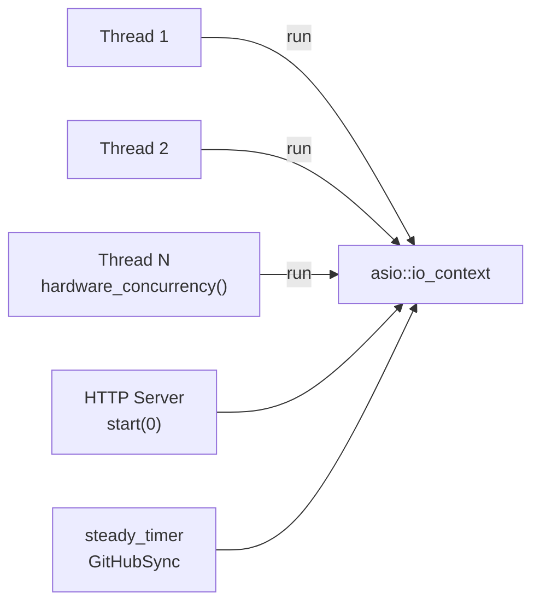
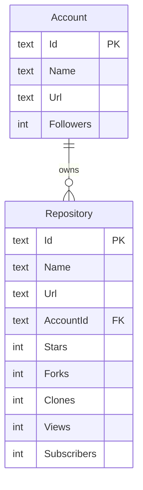
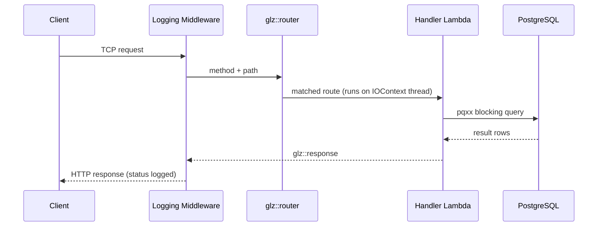

# Architecture

ICICLE Insights is a C++23 HTTP server that collects and stores metrics about ICICLE project
components from various platforms. It tracks repositories and accounts with platform-level
statistics such as stars, forks, clones, views, and watchers. The server is built on Asio for
async I/O, glaze for HTTP routing and JSON, and libpqxx for PostgreSQL access. Background sync
tasks share the same io_context as the HTTP server, avoiding the need for a separate thread pool
or scheduler infrastructure.

## Module Structure

```
include/insights/
├── core/
│   ├── config.hpp      # Config struct: Host, Port, DatabaseUrl, GitHubToken, LogDir, LogLevel
│   ├── http.hpp        # HttpStatus enum (Ok, Created, BadRequest, NotFound, InternalServerError)
│   ├── logging.hpp     # setupLogging(Config), createLogger(name, Config)
│   ├── result.hpp      # Error struct { string Message }
│   ├── routes.hpp      # registerCoreRoutes declaration
│   └── scheduler.hpp   # scheduleRecurringTask(Timer, Name, InitialDelay, Interval, Task)
├── db/
│   └── db.hpp          # Database struct, DbTraits<T> specializations, DbEntity concept
├── github/
│   ├── models.hpp      # Account, Repository models
│   ├── responses.hpp   # GitHubRepoStatsResponse, GitHubOrgStatsResponse
│   ├── routes.hpp      # CreateAccountSchema, CreateRepositorySchema, OutputAccountSchema,
│   │                   # OutputRepositorySchema, registerRoutes
│   └── tasks.hpp       # syncStats, updateRepositories, updateAccounts
├── ghcr/
│   └── models.hpp      # Container registry models (future)
└── server/
    ├── dependencies.hpp
    └── middleware/
        ├── logging.hpp  # createLoggingMiddleware()
        └── response.hpp

src/
├── insights.cpp         # Entry point
├── core/
│   └── routes.cpp       # /health and /routes endpoints, namespace insights::core
└── github/
    ├── routes.cpp       # GitHub route handlers, namespace insights::github
    └── tasks.cpp        # GitHub sync pipeline, namespace insights::github::tasks
```

## Core Patterns

### Error Handling

The project uses C++23 `std::expected<T, E>` throughout. The `Error` struct in
`include/insights/core/result.hpp` carries a single `string Message` field. Route handlers,
database operations, and task functions return `std::expected<..., core::Error>` directly and
propagate errors without throwing exceptions.

```cpp
// core/result.hpp
struct Error {
    std::string Message;
};
```

Callers use monadic operations (`and_then`, `transform`, `or_else`) or check `.has_value()`
before accessing the result:

```cpp
auto Account = Db->get<github::Account>(Id);
if (!Account) {
    return glz::response{HttpStatus::NotFound, Account.error().Message};
}
```

No exceptions cross API boundaries. Database functions, HTTP client calls, and task functions all
return `std::expected<..., core::Error>` or `void` with logged errors.

### Database Connection Management

The `Database` struct in `db/db.hpp` wraps a `pqxx::connection` and exposes generic CRUD
operations. One shared `ServerDatabase` connection is created at startup for HTTP route handlers.
Background sync tasks open a fresh `Database` connection inside each timer firing instead of
holding a long-lived `TasksDatabase` for weeks at a time.

```cpp
auto ServerDatabase = db::Database::connect(Config.DatabaseUrl);
```

Route handlers capture `ServerDatabase` by value through lambda closures registered with the
router. Task functions receive `Config` and connect on demand when they run.

### HTTP Routing

Routes are registered using glaze's `http_router`. Each module exposes a `registerRoutes`
function that takes the router and a database connection:

```cpp
// github/routes.hpp
auto registerRoutes(glz::http_router &Router, std::shared_ptr<db::Database> &Database)
    -> std::expected<void, core::Error>;
```

Handlers are lambdas that capture the database pointer and write into a `glz::response`:

```cpp
Router.get("/accounts/:id", [Database](const glz::request &Request, glz::response &Response) {
    auto Id = Request.params.at("id");
    auto Entry = Database->get<github::models::Account>(Id);
    if (!Entry) {
        Response.status(static_cast<int>(core::HttpStatus::InternalServerError))
            .json({{"error", Entry.error().Message}});
        return;
    }
    Response.status(static_cast<int>(core::HttpStatus::Ok))
        .json(OutputAccountSchema{.Id = Entry->Id, .Name = Entry->Name, .Followers = Entry->Followers});
});
```

Current routes:

| Method | Path | Description |
|--------|------|-------------|
| GET    | `/health` | Database ping, returns server status |
| GET    | `/routes` | Lists all registered routes |
| GET    | `/api/github/accounts` | List all GitHub accounts |
| POST   | `/api/github/accounts` | Create a GitHub account |
| GET    | `/api/github/accounts/:id` | Get a GitHub account by ID |
| DELETE | `/api/github/accounts/:id` | Delete a GitHub account |
| GET    | `/api/github/repos` | List all GitHub repositories |
| POST   | `/api/github/repos` | Create a GitHub repository |
| GET    | `/api/github/repos/:id` | Get a GitHub repository by ID |
| PATCH  | `/api/github/repos/:id` | Update a GitHub repository |
| DELETE | `/api/github/repos/:id` | Delete a GitHub repository |

### Generic Database Operations with DbTraits

The database layer uses a `DbTraits<T>` specialization pattern to associate each model type with
its table name, column list, insert statement, and result-set parser. A `DbEntity` concept
constrains template parameters to types that have a `DbTraits` specialization.

```cpp
template <DbEntity T>
std::expected<T, core::Error> get(std::string_view Id);

template <DbEntity T>
std::expected<std::vector<T>, core::Error> getAll();

template <DbEntity T>
std::expected<T, core::Error> create(const T& Entity);

template <DbEntity T>
std::expected<T, core::Error> remove(std::string_view Id);
```

Adding support for a new model requires only a `DbTraits<MyModel>` specialization — no new database functions.

This pattern uses templates + specializations rather than a base class + inheritance because the operations need to work with **concrete types** at the call site (`get<Account>()` returns an `Account`, not a `BaseModel`). With inheritance, all methods would return pointers to a base class and callers would need to downcast. Templates give you the same code reuse with zero runtime overhead and full type safety — the compiler generates the right code for each `T` at compile time, guided by the `DbTraits` specialization for that type.

### Background Task Scheduler

There is no `TaskScheduler` class. Background tasks are scheduled using the free function
`scheduleRecurringTask` from `core/scheduler.hpp`:

```cpp
void scheduleRecurringTask(
    std::shared_ptr<asio::steady_timer> Timer,
    std::string                          Name,
    std::chrono::duration<...>           InitialDelay,
    std::chrono::duration<...>           Interval,
    std::function<void()>                Task
);
```

The function arms the timer for `InitialDelay`, runs `Task()`, then re-arms for `Interval` on
each subsequent expiry. The timer is owned by the caller via `shared_ptr` so it stays alive for
the process lifetime.

The server and all timers share one `asio::io_context` (`IOContext`). The HTTP server is started
with `Server.start(0)` — the `0` tells glaze not to spin up internal worker threads. Instead,
the application creates `hardware_concurrency()` threads that all call `IOContext->run()`:


```mermaid
graph LR
    IOCtx[asio::io_context]
    T1[Thread 1]
    T2[Thread 2]
    TN["Thread N\nhardware_concurrency()"]
    HTTP["HTTP Server\nstart(0)"]
    Timer["steady_timer\nGitHubSync"]

    T1 -->|run| IOCtx
    T2 -->|run| IOCtx
    TN -->|run| IOCtx
    HTTP --> IOCtx
    Timer --> IOCtx
```

```cpp
// insights.cpp (simplified)
auto IOContext   = std::make_shared<asio::io_context>();
auto SyncTimer   = std::make_shared<asio::steady_timer>(*IOContext);
auto ThreadCount = std::thread::hardware_concurrency();
std::vector<std::thread> Workers;

Server.start(0);  // 0 = no internal threads; use our io_context

scheduleRecurringTask(
    SyncTimer,
    "GitHubSync",
    InitialDelay,         // DB resume if known, otherwise next Thursday
    weeks(2),             // repeat every two weeks
    [Config]() {
        github::tasks::syncStats(*Config);
    }
);

for (unsigned I = 0; I < ThreadCount; ++I) {
    Workers.emplace_back([&IOContext]() { IOContext->run(); });
}
for (auto& W : Workers) W.join();
```

Signal handling (SIGINT/SIGTERM) calls `Server.stop()`, `IOContext->stop()`, and
`spdlog::shutdown()` before the process exits.

## Data Model

The data model has two levels:


```mermaid
erDiagram
    Account {
        text Id PK
        text Name
        text Url
        int  Followers
    }
    Repository {
        text Id PK
        text Name
        text Url
        text AccountId FK
        int  Stars
        int  Forks
        int  Clones
        int  Views
        int  Subscribers
    }
    Account ||--o{ Repository : owns
```

- **Account** — a GitHub organization or user. Fields include `Id`, `Name`, `Url`, `Followers`.
- **Repository** — a tracked repository belonging to an account. Fields include `Id`, `Name`,
  `Url`, `AccountId`, plus metrics columns (stars, forks, clones, views, subscribers).

The two-level hierarchy (Account → Repository) reflects GitHub's own structure: repositories always belong to an owner (org or user). Storing the `AccountId` foreign key on each repository means you can query all repos for a given org without a join across unrelated tables, and deleting an account can cascade to its repositories cleanly.

Only the `github/` module is active. The `ghcr/` module directory exists as a placeholder for
future container registry support.

## HTTP Request Flow


```mermaid
sequenceDiagram
    participant C as Client
    participant MW as Logging Middleware
    participant R as glz::router
    participant H as Handler Lambda
    participant DB as PostgreSQL

    C->>MW: TCP request
    MW->>R: method + path
    R->>H: matched route (runs on IOContext thread)
    H->>DB: pqxx blocking query
    DB-->>H: result rows
    H-->>MW: glz::response
    MW-->>C: HTTP response (status logged)
```

1. An incoming TCP connection is accepted by glaze's `http_server`.
2. The logging middleware records the method, path, and response status.
3. The router matches the path against registered handlers.
4. The matched handler lambda executes on one of the `IOContext` worker threads.
5. The handler calls `Database` methods (blocking libpqxx calls on the same thread).
6. The handler returns a `glz::response` which glaze serializes and sends.

Because database calls are synchronous, each request occupies a worker thread for its duration.
The `hardware_concurrency()` thread pool provides parallelism without starving background timers,
which are also driven by the same `io_context`.

## Key Dependencies

| Package | Purpose |
|---------|---------|
| **asio** | Async I/O, io_context, steady_timer, signal_set |
| **glaze** | HTTP server, router, JSON serialization/deserialization |
| **libpq / libpqxx** | PostgreSQL C and C++ clients |
| **openssl** | TLS for outbound HTTP client requests |
| **spdlog** | Structured logging with named loggers and file sinks |

## Design Decisions

| Decision | Rationale |
|----------|-----------|
| `std::expected` instead of exceptions | Zero-cost on the happy path; forces callers to handle errors explicitly at API boundaries |
| Startup DB for routes + per-run DB for tasks | Keeps request handling simple while avoiding stale idle task connections |
| Shared io_context for server and timers | Single thread pool serves both HTTP and scheduled tasks; no extra threads or synchronization |
| `Server.start(0)` with manual thread pool | Full control over concurrency; threads are joined on shutdown for a clean exit |
| Free function scheduler, no class | Simpler than a scheduler object; ownership is explicit via the `shared_ptr<steady_timer>` |
| Per-component named loggers | Each subsystem (server, github_sync) writes to its own log file and to shared stdout |
| `flush_on(warn)` + `flush_every(1s)` | Captures errors immediately while keeping I/O overhead low during normal operation |
| glaze non-TLS mode (`http_server<false>`) | TLS termination is delegated to a reverse proxy in production |
