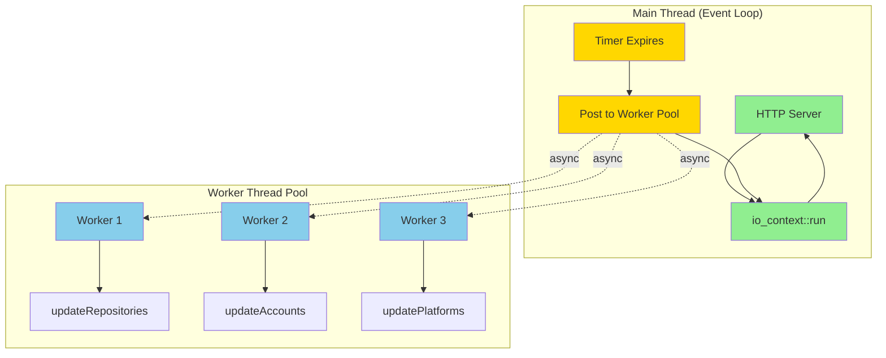
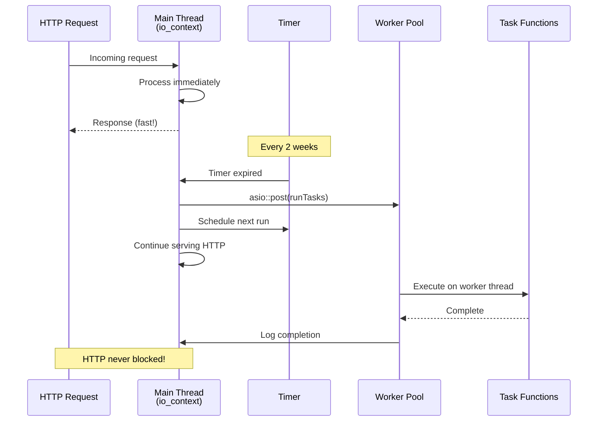
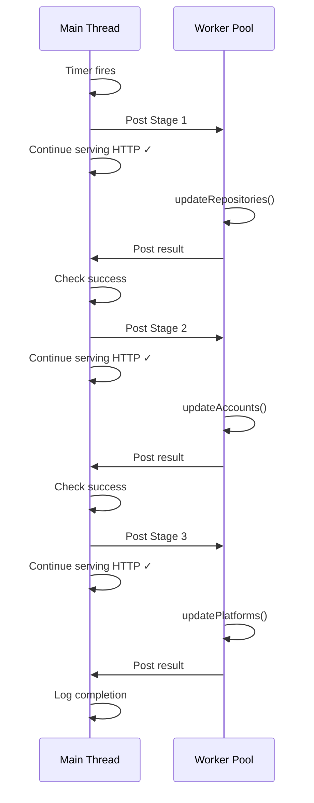
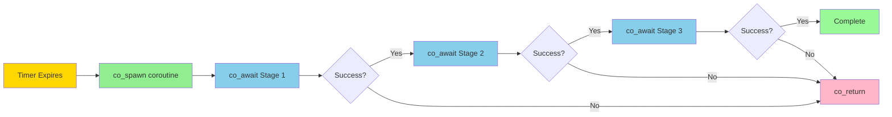
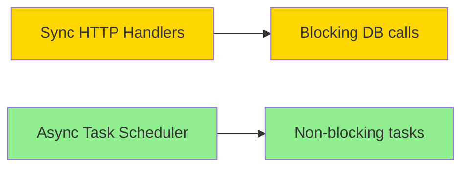
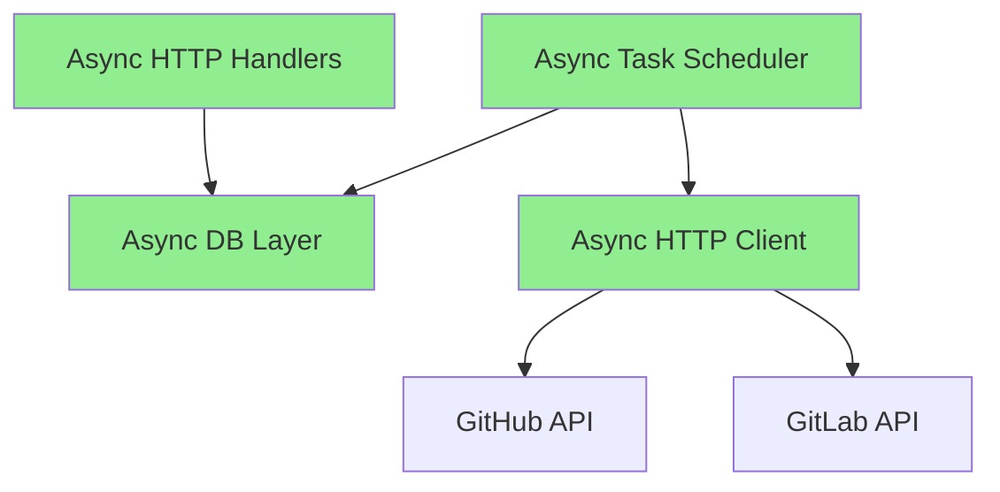

# Async Task Patterns with ASIO

This guide explores non-blocking approaches to running periodic background tasks, progressing from simple to advanced patterns.

## Context: Sync vs Async HTTP

**Current State:** The project uses **synchronous HTTP handlers** with glaze for simplicity during initial development:

```cpp
Router.get("/platforms", [Database](auto &Req, auto &Res) {
  auto Platforms = Database->getAll<Platform>();  // Blocks current request
  Res.send(Platforms);
});
```

**Future State:** Glaze supports **async handlers** that can leverage ASIO for non-blocking I/O:

```cpp
Router.get("/platforms", [Database](auto &Req, auto &Res) -> asio::awaitable<void> {
  auto Platforms = co_await Database->getAllAsync<Platform>();  // Async!
  Res.send(Platforms);
});
```

**Why This Guide Matters:**
- Background tasks (updating Git metrics every 2 weeks) should be **non-blocking** even with sync HTTP handlers
- When you migrate HTTP to async, these patterns become even more critical
- Learning async patterns now prepares you for the full async migration

## Learning Goals

- Understand ASIO's async execution model
- Use thread pools to avoid blocking the event loop
- Chain async operations with callbacks
- Explore C++20 coroutines with ASIO
- Handle errors in async contexts
- Prepare for full async HTTP migration

## Pattern 1: Thread Pool with asio::post

**Concept:** Offload heavy work to a separate thread pool, keeping the main event loop responsive.

### Architecture Diagram



### Execution Flow



### Implementation

```cpp
// include/git/scheduler.hpp
#pragma once
#include "core/result.hpp"
#include "db/db.hpp"
#include <asio/steady_timer.hpp>
#include <asio/thread_pool.hpp>
#include <asio/post.hpp>
#include <memory>
#include <chrono>

namespace insights::git {

class TaskScheduler {
public:
  TaskScheduler(asio::io_context &Io, std::shared_ptr<db::Database> Db,
                size_t ThreadPoolSize = 2);

  void start(std::chrono::seconds Interval);
  void stop();
  bool isRunning() const { return Running; }

private:
  void scheduleNext();
  void onTimerExpired(const std::error_code &Error);
  void runTasksAsync();

  asio::steady_timer Timer;
  asio::thread_pool WorkerPool;  // Separate threads for heavy work
  std::shared_ptr<db::Database> Db;
  std::chrono::seconds Interval;
  bool Running;
};

} // namespace insights::git
```

```cpp
// src/git/scheduler.cpp
#include "git/scheduler.hpp"
#include "git/tasks.hpp"
#include <spdlog/spdlog.h>

namespace insights::git {

TaskScheduler::TaskScheduler(asio::io_context &Io,
                             std::shared_ptr<db::Database> Db,
                             size_t ThreadPoolSize)
    : Timer(Io), WorkerPool(ThreadPoolSize), Db(std::move(Db)), Running(false) {
  spdlog::debug("TaskScheduler created with {} worker threads", ThreadPoolSize);
}

void TaskScheduler::start(std::chrono::seconds Interval) {
  if (Running) {
    spdlog::warn("TaskScheduler already running");
    return;
  }

  this->Interval = Interval;
  Running = true;

  spdlog::info("Starting task scheduler (interval: {}s, non-blocking)", Interval.count());

  // Run initial tasks asynchronously
  runTasksAsync();

  // Schedule periodic runs
  scheduleNext();
}

void TaskScheduler::stop() {
  if (!Running) return;

  spdlog::info("Stopping task scheduler");
  Running = false;
  Timer.cancel();

  // Wait for in-flight tasks to complete
  WorkerPool.join();
}

void TaskScheduler::scheduleNext() {
  if (!Running) return;

  Timer.expires_after(Interval);
  Timer.async_wait([this](const std::error_code &Error) {
    onTimerExpired(Error);
  });
}

void TaskScheduler::onTimerExpired(const std::error_code &Error) {
  if (Error == asio::error::operation_aborted) {
    spdlog::debug("Task timer cancelled (clean shutdown)");
    return;
  }

  if (Error) {
    spdlog::error("Timer error: {}", Error.message());
    return;
  }

  if (!Running) return;

  // Post work to thread pool (non-blocking)
  runTasksAsync();

  // Schedule next run immediately - doesn't wait for tasks to complete
  scheduleNext();
}

void TaskScheduler::runTasksAsync() {
  spdlog::info("Scheduling background tasks (async)");

  // Post work to thread pool - returns immediately
  asio::post(WorkerPool, [Db = this->Db]() {
    spdlog::debug("Task execution starting on worker thread");
    auto StartTime = std::chrono::steady_clock::now();

    auto Result = tasks::runAll(*Db);

    auto Duration = std::chrono::steady_clock::now() - StartTime;
    auto DurationMs = std::chrono::duration_cast<std::chrono::milliseconds>(Duration).count();

    if (!Result) {
      spdlog::error("Task execution failed after {}ms: {}", DurationMs, Result.error().Message);
    } else {
      spdlog::info("Tasks completed successfully in {}ms", DurationMs);
    }
  });

  spdlog::debug("Tasks posted to worker pool, main thread continues");
}

} // namespace insights::git
```

**Key Points:**
- ✅ Timer callback returns immediately
- ✅ Heavy work runs on separate thread
- ✅ HTTP requests never blocked
- ⚠️ Need thread-safe database access

## Pattern 2: Structured Task Pipeline

**Concept:** Break `runAll()` into stages that post back to the event loop between steps.

```cpp
// src/git/scheduler.cpp (alternative implementation)

void TaskScheduler::runTasksAsync() {
  spdlog::info("Starting async task pipeline");

  // Stage 1: Update repositories (on worker thread)
  asio::post(WorkerPool, [this]() {
    spdlog::debug("Stage 1: Updating repositories");
    auto Result = tasks::updateRepositories(*Db);

    // Post result back to main thread for stage 2
    asio::post(Timer.get_executor(), [this, Result]() {
      if (!Result) {
        spdlog::error("Repository update failed: {}", Result.error().Message);
        return;  // Stop pipeline
      }

      // Stage 2: Update accounts (on worker thread)
      asio::post(WorkerPool, [this]() {
        spdlog::debug("Stage 2: Updating accounts");
        auto Result = tasks::updateAccounts(*Db);

        asio::post(Timer.get_executor(), [this, Result]() {
          if (!Result) {
            spdlog::error("Account update failed: {}", Result.error().Message);
            return;
          }

          // Stage 3: Update platforms (on worker thread)
          asio::post(WorkerPool, [this]() {
            spdlog::debug("Stage 3: Updating platforms");
            auto Result = tasks::updatePlatforms(*Db);

            asio::post(Timer.get_executor(), [Result]() {
              if (!Result) {
                spdlog::error("Platform update failed: {}", Result.error().Message);
              } else {
                spdlog::info("Full pipeline completed successfully");
              }
            });
          });
        });
      });
    });
  });

  spdlog::debug("Pipeline initiated");
}
```

**Visualization:**



**Key Points:**
- ✅ Event loop never blocked
- ✅ Clear stage progression
- ✅ Error handling at each stage
- ❌ Callback hell (nested lambdas)

## Pattern 3: Parallel Execution

**Concept:** Run independent tasks concurrently on the thread pool.

```cpp
void TaskScheduler::runTasksParallel() {
  spdlog::info("Starting parallel task execution");

  // Use a shared counter to track completion
  auto CompletionCount = std::make_shared<std::atomic<int>>(0);
  auto TotalTasks = 3;

  auto OnComplete = [CompletionCount, TotalTasks]() {
    if (++(*CompletionCount) == TotalTasks) {
      spdlog::info("All parallel tasks completed");
    }
  };

  // Launch all three tasks in parallel
  asio::post(WorkerPool, [this, OnComplete]() {
    spdlog::debug("Parallel task: Repositories");
    auto Result = tasks::updateRepositories(*Db);
    if (!Result) spdlog::error("Repo update failed: {}", Result.error().Message);
    OnComplete();
  });

  asio::post(WorkerPool, [this, OnComplete]() {
    spdlog::debug("Parallel task: Accounts");
    auto Result = tasks::updateAccounts(*Db);
    if (!Result) spdlog::error("Account update failed: {}", Result.error().Message);
    OnComplete();
  });

  asio::post(WorkerPool, [this, OnComplete]() {
    spdlog::debug("Parallel task: Platforms");
    auto Result = tasks::updatePlatforms(*Db);
    if (!Result) spdlog::error("Platform update failed: {}", Result.error().Message);
    OnComplete();
  });

  spdlog::debug("3 tasks posted to worker pool");
}
```

**Caution:** Only works if tasks are independent! In your case, you have dependencies (Repos → Accounts → Platforms).

## Pattern 4: C++20 Coroutines with ASIO (Advanced)

**Concept:** Use `co_await` for sequential async operations without callback hell.

### Coroutine Flow Diagram



### Control Flow Comparison

```mermaid
graph TB
    subgraph "Callback Hell (Pattern 2)"
        A1[Start] --> B1[Task 1]
        B1 --> C1[Callback]
        C1 --> D1[Task 2]
        D1 --> E1[Callback]
        E1 --> F1[Task 3]
        F1 --> G1[Callback]
        G1 --> H1[Done]
    end

    subgraph "Coroutines (Pattern 4)"
        A2[Start] --> B2[co_await Task 1]
        B2 --> C2[co_await Task 2]
        C2 --> D2[co_await Task 3]
        D2 --> E2[Done]
    end

    style A2 fill:#90EE90
    style B2 fill:#90EE90
    style C2 fill:#90EE90
    style D2 fill:#90EE90
    style E2 fill:#90EE90
```



### Setup

```cpp
// include/git/scheduler.hpp
#include <asio/co_spawn.hpp>
#include <asio/detached.hpp>
#include <asio/awaitable.hpp>

namespace insights::git {

class TaskScheduler {
  // ... existing members ...

private:
  asio::awaitable<void> runTasksCoroutine();
  asio::awaitable<core::Result<void>> runTaskInPool(
    std::function<core::Result<void>()> Task);
};

}
```

```cpp
// src/git/scheduler.cpp
#include <asio/use_awaitable.hpp>

namespace insights::git {

void TaskScheduler::runTasksAsync() {
  // Spawn coroutine on the event loop
  asio::co_spawn(Timer.get_executor(),
    [this]() { return runTasksCoroutine(); },
    asio::detached);
}

asio::awaitable<void> TaskScheduler::runTasksCoroutine() {
  spdlog::info("Starting coroutine task pipeline");

  // Stage 1: Repositories
  auto RepoResult = co_await runTaskInPool([this]() {
    return tasks::updateRepositories(*Db);
  });

  if (!RepoResult) {
    spdlog::error("Repository update failed: {}", RepoResult.error().Message);
    co_return;
  }

  // Stage 2: Accounts
  auto AccountResult = co_await runTaskInPool([this]() {
    return tasks::updateAccounts(*Db);
  });

  if (!AccountResult) {
    spdlog::error("Account update failed: {}", AccountResult.error().Message);
    co_return;
  }

  // Stage 3: Platforms
  auto PlatformResult = co_await runTaskInPool([this]() {
    return tasks::updatePlatforms(*Db);
  });

  if (!PlatformResult) {
    spdlog::error("Platform update failed: {}", PlatformResult.error().Message);
    co_return;
  }

  spdlog::info("All tasks completed successfully");
}

asio::awaitable<core::Result<void>> TaskScheduler::runTaskInPool(
    std::function<core::Result<void>()> Task) {

  // Create a promise to bridge thread pool and coroutine
  auto Promise = std::make_shared<std::promise<core::Result<void>>>();
  auto Future = Promise->get_future();

  // Post work to thread pool
  asio::post(WorkerPool, [Task = std::move(Task), Promise]() {
    try {
      Promise->set_value(Task());
    } catch (...) {
      Promise->set_exception(std::current_exception());
    }
  });

  // Await result (without blocking event loop!)
  // This uses asio's executor to resume when ready
  co_return co_await asio::async_wait_until(Future, asio::use_awaitable);
}

} // namespace insights::git
```

**Benefits of Coroutines:**
- ✅ Sequential code structure (reads like sync code)
- ✅ No callback hell
- ✅ Automatic cleanup
- ✅ Exception handling with try/catch
- ✅ Modern C++ idiom

**Simplified Coroutine Example:**

```cpp
asio::awaitable<void> TaskScheduler::runTasksCoroutine() {
  // Looks synchronous, but doesn't block!
  auto Repo = co_await runTaskInPool([]() { /* update repos */ });
  if (!Repo) co_return;

  auto Acct = co_await runTaskInPool([]() { /* update accounts */ });
  if (!Acct) co_return;

  auto Plat = co_await runTaskInPool([]() { /* update platforms */ });
  // Done!
}
```

## Pattern 5: Custom Async Task Executor

**Concept:** Build a reusable async task runner with composition support.

```cpp
// include/core/async_task.hpp
#pragma once
#include "core/result.hpp"
#include <asio/thread_pool.hpp>
#include <asio/post.hpp>
#include <functional>
#include <memory>

namespace insights::core {

template <typename T>
class AsyncTask {
public:
  using TaskFunc = std::function<Result<T>()>;
  using CompletionHandler = std::function<void(Result<T>)>;

  AsyncTask(asio::thread_pool &Pool, TaskFunc Task)
      : Pool(Pool), Task(std::move(Task)) {}

  // Execute the task asynchronously
  void execute(CompletionHandler Handler) {
    asio::post(Pool, [Task = this->Task, Handler = std::move(Handler)]() {
      auto Result = Task();
      Handler(Result);
    });
  }

  // Chain another task that depends on this one's result
  template <typename U>
  AsyncTask<U> then(std::function<Result<U>(T)> NextTask) {
    // TODO: Implement task chaining
  }

private:
  asio::thread_pool &Pool;
  TaskFunc Task;
};

} // namespace insights::core
```

Usage:

```cpp
void TaskScheduler::runTasksAsync() {
  core::AsyncTask<void> RepoTask(WorkerPool, [this]() {
    return tasks::updateRepositories(*Db);
  });

  RepoTask.execute([this](auto Result) {
    if (!Result) {
      spdlog::error("Repo update failed: {}", Result.error().Message);
      return;
    }

    core::AsyncTask<void> AccountTask(WorkerPool, [this]() {
      return tasks::updateAccounts(*Db);
    });

    AccountTask.execute([this](auto Result) {
      if (!Result) {
        spdlog::error("Account update failed: {}", Result.error().Message);
        return;
      }

      core::AsyncTask<void> PlatformTask(WorkerPool, [this]() {
        return tasks::updatePlatforms(*Db);
      });

      PlatformTask.execute([](auto Result) {
        if (!Result) {
          spdlog::error("Platform update failed: {}", Result.error().Message);
        } else {
          spdlog::info("All tasks completed");
        }
      });
    });
  });
}
```

## Comparison Table

| Pattern | Complexity | Readability | Non-blocking | Learning Value |
|---------|-----------|-------------|--------------|----------------|
| Thread Pool (1) | Low | High | ✅ | Medium |
| Staged Pipeline (2) | Medium | Medium | ✅ | High |
| Parallel (3) | Low | High | ✅ | Medium |
| Coroutines (4) | High | Very High | ✅ | Very High |
| Custom Executor (5) | Very High | Medium | ✅ | Very High |

## Migration Path to Full Async

### Phase 1: Async Background Tasks (Current)



**Status:** Background tasks run async on thread pool, HTTP remains synchronous.

### Phase 2: Async Database Layer

```cpp
// Add async variants alongside sync methods
class Database {
  // Sync (current)
  Result<Platform> get(const std::string &Id);

  // Async (future)
  asio::awaitable<Result<Platform>> getAsync(const std::string &Id);
};
```

### Phase 3: Async HTTP Handlers

```cpp
// Migrate handlers to coroutines
Router.get("/platforms", [Database](auto &Req, auto &Res) -> asio::awaitable<void> {
  auto Platforms = co_await Database->getAllAsync<Platform>();
  Res.send(Platforms);
});
```

### Phase 4: Full Async System



**Result:** Fully non-blocking system with high concurrency.

## Recommended Learning Path

1. **Start with Pattern 1** (Thread Pool) - Simple, practical, production-ready
2. **Add Pattern 2** (Staged Pipeline) - Understand async flow control
3. **Experiment with Pattern 4** (Coroutines) - Modern C++ async (most valuable skill)
4. **Explore Pattern 5** (Custom Executor) - Deep understanding of async primitives
5. **Migrate HTTP to async** - Apply learnings to full async system

## Thread Safety Considerations

### Database Connection Pool

Your `Database` class needs to be thread-safe:

```cpp
// db/db.hpp
class Database {
public:
  // Option 1: Internal mutex
  core::Result<Platform> getPlatform(int Id) {
    std::lock_guard<std::mutex> Lock(Mutex);
    // Execute query
  }

private:
  std::mutex Mutex;

  // Option 2: Connection pool (better)
  ConnectionPool Pool;
};
```

### Shared State

Avoid shared mutable state. Use `shared_ptr` for read-only data:

```cpp
// Good: Immutable shared config
auto Config = std::make_shared<const ServerConfig>(/* ... */);

asio::post(WorkerPool, [Config]() {
  // Safe to read Config from any thread
});

// Bad: Mutable shared state
std::vector<int> SharedVec;  // Race condition!

asio::post(WorkerPool, [&SharedVec]() {
  SharedVec.push_back(42);  // UNSAFE!
});
```

## Testing

### Test with Short Intervals

```cpp
TEST(AsyncScheduler, NonBlocking) {
  asio::io_context Io;
  auto Db = std::make_shared<MockDatabase>();

  TaskScheduler Scheduler(Io, Db, 2);  // 2 worker threads
  Scheduler.start(std::chrono::seconds(5));

  // Run for a bit
  std::thread IoThread([&]() { Io.run(); });

  // Simulate HTTP request
  std::this_thread::sleep_for(std::chrono::milliseconds(100));

  // Request should complete quickly even if tasks are running
  auto Start = std::chrono::steady_clock::now();
  // Make HTTP request...
  auto Duration = std::chrono::steady_clock::now() - Start;

  EXPECT_LT(Duration, std::chrono::milliseconds(50));  // Fast!

  Scheduler.stop();
  Io.stop();
  IoThread.join();
}
```

## Performance Monitoring

```cpp
void TaskScheduler::runTasksAsync() {
  auto StartTime = std::chrono::steady_clock::now();

  asio::post(WorkerPool, [StartTime, Db = this->Db]() {
    auto QueueTime = std::chrono::steady_clock::now() - StartTime;

    spdlog::debug("Task started (queue time: {}ms)",
      std::chrono::duration_cast<std::chrono::milliseconds>(QueueTime).count());

    auto ExecStart = std::chrono::steady_clock::now();
    auto Result = tasks::runAll(*Db);
    auto ExecTime = std::chrono::steady_clock::now() - ExecStart;

    spdlog::info("Task completed (exec time: {}ms)",
      std::chrono::duration_cast<std::chrono::milliseconds>(ExecTime).count());
  });
}
```

## Next Steps

1. **Implement Pattern 1** first - get non-blocking behavior working
2. **Measure** - Add timing logs to see actual execution times
3. **Iterate** - Try Pattern 4 (coroutines) for cleaner code
4. **Deploy** - Run in production with real workloads

This async knowledge will transfer directly to your research project!
