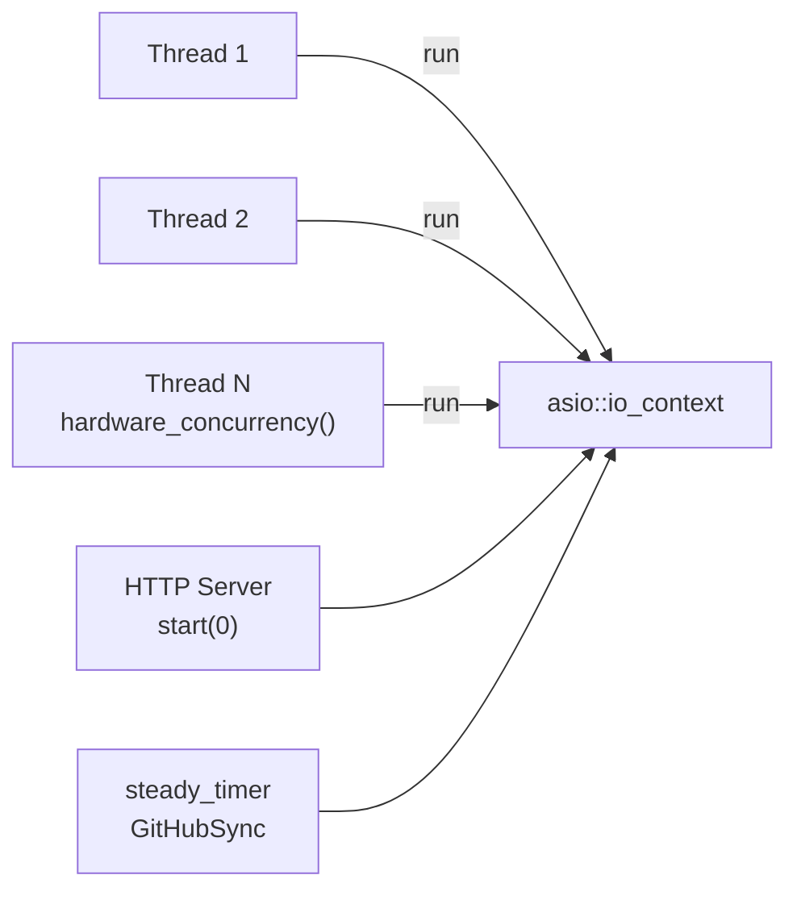
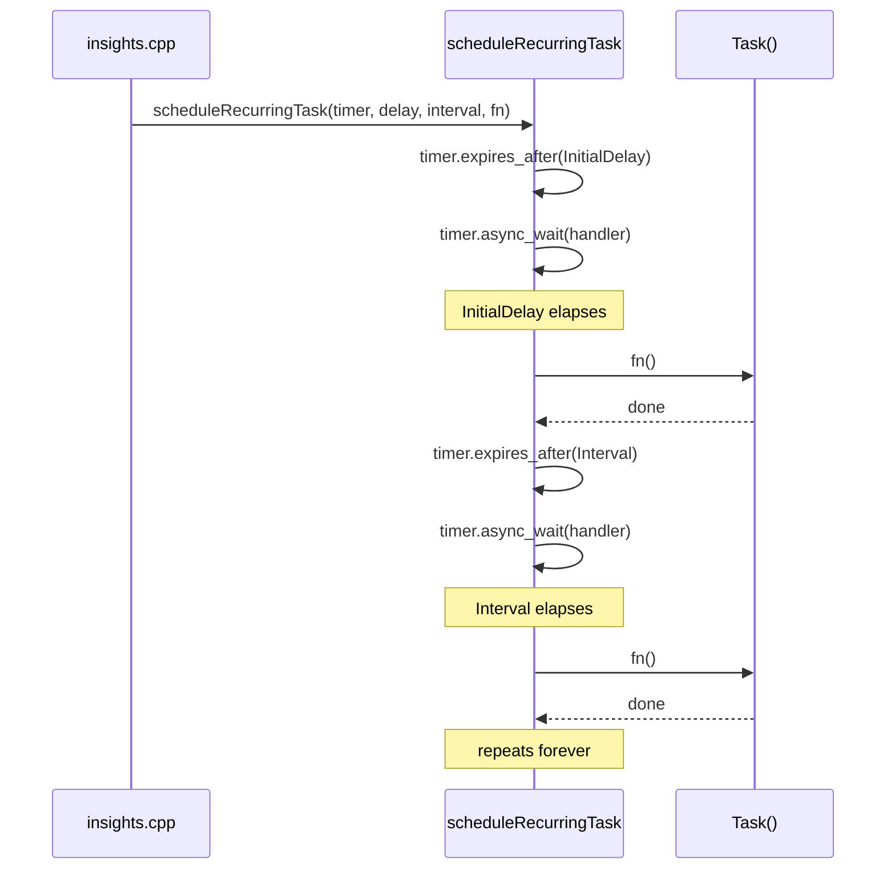

# Background Task Scheduling

How the server runs periodic work (like syncing GitHub metrics) while continuing
to serve HTTP requests.

---

## How It Works

The server and all background timers share a **single `asio::io_context`**. The
HTTP server is started with `Server.start(0)` — zero internal threads — so the
application creates `hardware_concurrency()` threads that all call
`IOContext->run()`. This thread pool serves both HTTP requests and timer callbacks
with no extra synchronization needed.



There is no `TaskScheduler` class. Background tasks are registered using the
free function `scheduleRecurringTask` from `core/scheduler.hpp`.

---

## `scheduleRecurringTask`

```cpp
// include/insights/core/scheduler.hpp
void scheduleRecurringTask(
    std::shared_ptr<asio::steady_timer>  Timer,
    std::string_view                     Name,
    std::chrono::steady_clock::duration  InitialDelay,
    std::chrono::steady_clock::duration  Interval,
    std::function<void()>                Task
);
```

The function:

1. Arms the timer for `InitialDelay`
2. When the timer fires: logs `[Name]: Starting...`, calls `Task()`, logs elapsed time
3. Re-arms the timer for `Interval` and repeats

The `shared_ptr<steady_timer>` is owned by the caller so it stays alive for the
process lifetime.

### Timer lifecycle



---

## Current Task: GitHubSync

Registered in `src/insights.cpp`:

```cpp
auto GitHubSyncTimer = std::make_shared<asio::steady_timer>(*IOContext);

// Fire on next Saturday, then every 2 weeks
auto Now            = std::chrono::system_clock::now();
auto Today          = std::chrono::floor<std::chrono::days>(Now);
auto CurrentDay     = std::chrono::weekday(Today);
auto DaysUntilSat   = (6 - CurrentDay.c_encoding() + 7) % 7;

insights::core::scheduleRecurringTask(
    GitHubSyncTimer,
    "GitHubSync",
    std::chrono::days(DaysUntilSat),   // initial delay
    std::chrono::weeks(2),              // repeat interval
    [&] {
        insights::github::tasks::syncStats(**TasksDatabase, *Config);
    }
);
```

The task calls `syncStats`, which makes HTTPS requests to the GitHub API and
updates repository and account metrics in PostgreSQL.

---

## Adding a New Task

**1. Write the task function** in `src/<module>/tasks.cpp`:

```cpp
namespace insights::mymodule::tasks {

static auto Log() { return spdlog::get("my_task"); }

auto doWork(db::Database &Db, const core::Config &Config)
    -> std::expected<void, core::Error> {
    // ... your logic ...
    Log()->info("Done.");
    return {};
}

} // namespace insights::mymodule::tasks
```

**2. Register a logger** in `src/insights.cpp` (after `setupLogging`):

```cpp
insights::core::createLogger("my_task", *Config);
```

This creates `{LOG_DIR}/my_task.log` automatically.

**3. Create a timer and schedule it** in `src/insights.cpp`, before the thread
pool loop:

```cpp
auto MyTimer = std::make_shared<asio::steady_timer>(*IOContext);
insights::core::scheduleRecurringTask(
    MyTimer,
    "MyTask",
    std::chrono::seconds(0),    // run immediately on startup
    std::chrono::hours(24),     // then once a day
    [&] {
        mymodule::tasks::doWork(*TasksDatabase, *Config);
    }
);
```

The timer `shared_ptr` must stay in scope until the thread pool joins (keep it
in the same scope as the thread vector).

---

## Shutdown

Signal handling (`SIGINT`/`SIGTERM`) in `insights.cpp` calls:

```cpp
Server.stop();
IOContext->stop();
spdlog::shutdown();
```

`IOContext->stop()` cancels all pending timer callbacks and unblocks all threads
cleanly. In-flight task calls are allowed to finish before `join()` returns.

---

## Error Handling

Task functions return `std::expected<void, core::Error>`. The scheduler wrapper
does not inspect the return value — tasks are responsible for logging errors
internally and deciding whether to continue or abort.

The `github::tasks::syncStats` pipeline uses `continue` for per-repository API
failures so one bad response doesn't abort the whole batch.

---

## Why ASIO Timers

| Approach | Verdict |
|----------|---------|
| ASIO timers (current) | ✅ Shares `io_context` with HTTP; no extra threads; clean shutdown via `IOContext->stop()` |
| Separate thread + sleep | ❌ Thread sync complexity; no automatic shutdown integration |
| External cron / systemd timer | ❌ Requires deployment config; can't share application state |
| `TaskScheduler` class | ❌ Unnecessary abstraction; `shared_ptr<timer>` + free function covers all use cases |
