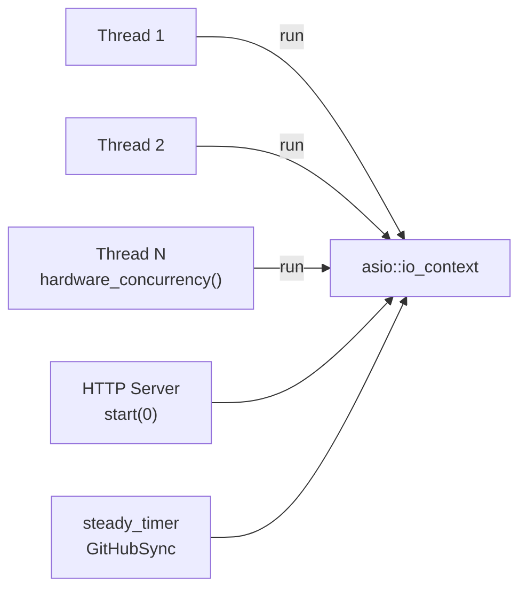
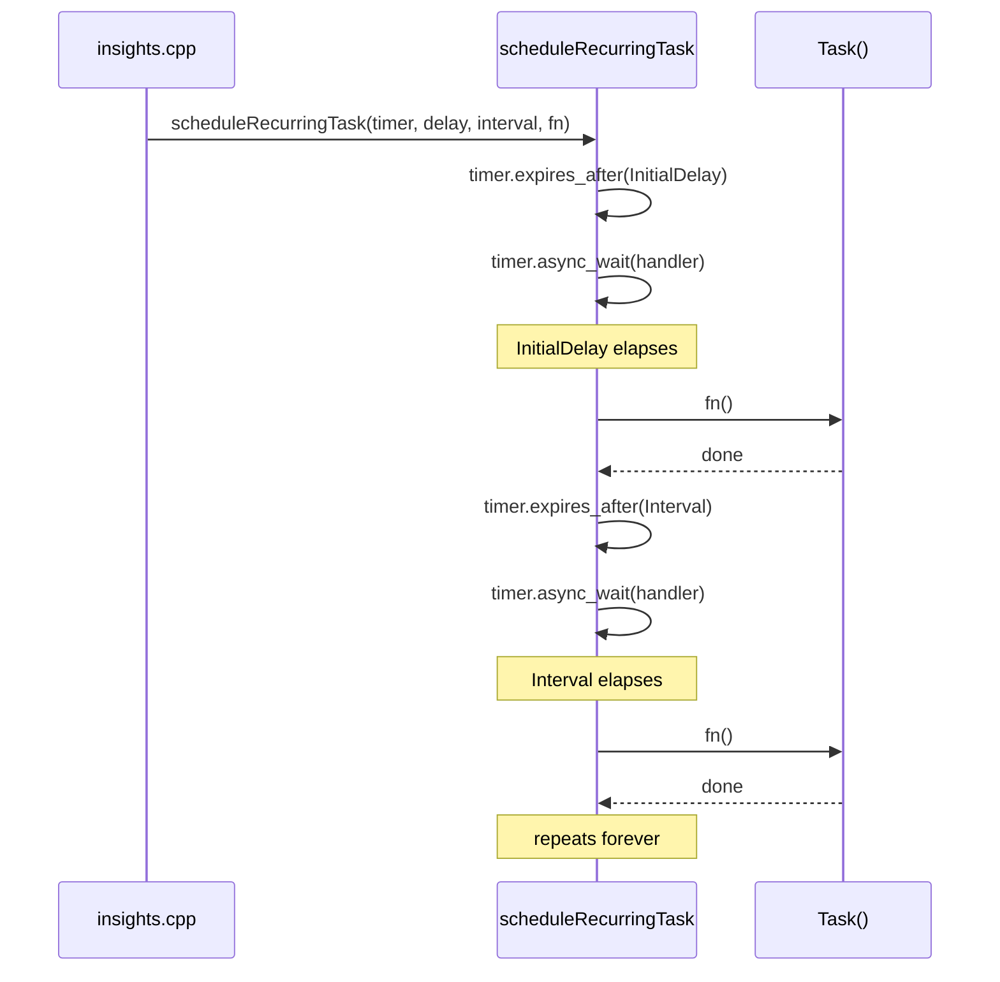

# Background Task Scheduling

How the server runs periodic work (like syncing GitHub metrics) while continuing
to serve HTTP requests.

---

## How It Works

The server and all background timers share a **single `asio::io_context`**. The
HTTP server is started with `Server.start(0)` — zero internal threads — so the
application creates `hardware_concurrency()` threads that all call
`IOContext->run()`. This thread pool serves both HTTP requests and timer callbacks
with no extra synchronization needed.


```mermaid
graph LR
    IOCtx[asio::io_context]
    T1[Thread 1]
    T2[Thread 2]
    TN["Thread N\nhardware_concurrency()"]
    HTTP["HTTP Server\nstart(0)"]
    Timer["steady_timer\nGitHubSync"]

    T1 -->|run| IOCtx
    T2 -->|run| IOCtx
    TN -->|run| IOCtx
    HTTP --> IOCtx
    Timer --> IOCtx
```

There is no `TaskScheduler` class. Background tasks are registered using the
free function `scheduleRecurringTask` from `core/scheduler.hpp`.

---

## `scheduleRecurringTask`

```cpp
// include/insights/core/scheduler.hpp
void scheduleRecurringTask(
    std::shared_ptr<asio::steady_timer>  Timer,
    std::string_view                     Name,
    std::chrono::steady_clock::duration  InitialDelay,
    std::chrono::steady_clock::duration  Interval,
    std::function<void()>                Task
);
```

The function:

1. Arms the timer for `InitialDelay`
2. When the timer fires: logs `[Name]: Starting...`, calls `Task()`, logs elapsed time
3. Re-arms the timer for `Interval` and repeats

The `shared_ptr<steady_timer>` is owned by the caller so it stays alive for the
process lifetime.

### Timer lifecycle


```mermaid
sequenceDiagram
    participant App as insights.cpp
    participant Sched as scheduleRecurringTask
    participant Task as Task()

    App->>Sched: scheduleRecurringTask(timer, delay, interval, fn)
    Sched->>Sched: timer.expires_after(InitialDelay)
    Sched->>Sched: timer.async_wait(handler)

    Note over Sched: InitialDelay elapses
    Sched->>Task: fn()
    Task-->>Sched: done
    Sched->>Sched: timer.expires_after(Interval)
    Sched->>Sched: timer.async_wait(handler)

    Note over Sched: Interval elapses
    Sched->>Task: fn()
    Task-->>Sched: done
    Note over Sched: repeats forever
```

---

## Current Task: GitHubSync

Registered in `src/insights.cpp`:

```cpp
auto GitHubSyncTimer = std::make_shared<asio::steady_timer>(*IOContext);

// Query DB for seconds until the next scheduled run.
// Returns nullopt on first-ever run; negative if overdue — both run immediately.
auto SyncInterval = std::chrono::duration_cast<std::chrono::seconds>(std::chrono::weeks(2));
auto DelayResult = ServerDatabase.value()->querySecondsUntilNextRun("GitHubSync", SyncInterval);
if (!DelayResult) {
    // fail startup; scheduling state could not be loaded
}
auto SecondsUntilNext = (DelayResult && *DelayResult)
    ? std::max(**DelayResult, 0LL)
    : 0LL;
auto InitialDelay = std::chrono::seconds(SecondsUntilNext);
auto NextRunAt = formatTimestamp(std::chrono::system_clock::now() + InitialDelay);

insights::core::scheduleRecurringTask(
    GitHubSyncTimer,
    "GitHubSync",
    InitialDelay,                  // immediate if never run or overdue; otherwise wait remaining time
    std::chrono::weeks(2),         // repeat interval
    [Config] {
        auto Result = insights::github::tasks::syncStats(*Config);
        if (!Result) {
            spdlog::get("github_sync")->error("GitHubSync failed: {}", Result.error().Message);
        } else {
            spdlog::get("github_sync")->info("GitHubSync finished successfully.");
        }
    }
);
```

The task calls `syncStats`, which opens a fresh DB connection for that run, makes HTTPS
requests to the GitHub API, updates repository and account metrics in
PostgreSQL, records the run timestamp via `recordTaskRun("GitHubSync")`, and
stores per-attempt detail in `task_run_attempts`.

### Task status and admin trigger

Current operational endpoints:

- `GET /tasks/github-sync` — returns last successful run, last attempt
  status/summary, processed vs failed counts, and computed next run
- `POST /api/github/repos/:id/sync` — sync one repository immediately by ID
  using the same GitHub fetch/update logic as the scheduled task

---

## Adding a New Task

**1. Write the task function** in `src/<module>/tasks.cpp`:

```cpp
namespace insights::mymodule::tasks {

static auto Log() { return spdlog::get("my_task"); }

auto doWork(const core::Config &Config)
    -> std::expected<void, core::Error> {
    // Open a fresh connection — closed automatically at scope exit.
    auto DatabaseResult = db::Database::connect(Config.DatabaseUrl);
    if (!DatabaseResult) {
        return std::unexpected(DatabaseResult.error());
    }
    auto &Database = **DatabaseResult;

    // ... your logic ...
    Log()->info("Done.");
    return {};
}

} // namespace insights::mymodule::tasks
```

**2. Register a logger** in `src/insights.cpp` (after `setupLogging`):

```cpp
insights::core::createLogger("my_task", *Config);
```

This creates `{LOG_DIR}/my_task.log` automatically.

**3. Create a timer and schedule it** in `src/insights.cpp`, before the thread
pool loop:

```cpp
auto MyTimer = std::make_shared<asio::steady_timer>(*IOContext);
insights::core::scheduleRecurringTask(
    MyTimer,
    "MyTask",
    std::chrono::seconds(0),    // run immediately on startup
    std::chrono::hours(24),     // then once a day
    [Config] {
        mymodule::tasks::doWork(*Config);
    }
);
```

The timer `shared_ptr` must stay in scope until the thread pool joins (keep it
in the same scope as the thread vector).

---

## Shutdown

Signal handling (`SIGINT`/`SIGTERM`) in `insights.cpp` calls:

```cpp
Server.stop();
IOContext->stop();
spdlog::shutdown();
```

`IOContext->stop()` cancels all pending timer callbacks and unblocks all threads
cleanly. In-flight task calls are allowed to finish before `join()` returns.

---

## Error Handling

Task functions return `std::expected<void, core::Error>`. The scheduler wrapper
logs failed results and the GitHub sync path records detailed attempt metadata
for `success`, `partial_success`, `failed`, and `skipped` outcomes.

The `github::tasks::syncStats` pipeline uses `continue` for per-repository API
failures so one bad response doesn't abort the whole batch. Those partial
failures are now recorded in `task_run_attempts` instead of being invisible.

---

## Why ASIO Timers

| Approach | Verdict |
|----------|---------|
| ASIO timers (current) | ✅ Shares `io_context` with HTTP; no extra threads; clean shutdown via `IOContext->stop()` |
| Separate thread + sleep | ❌ Thread sync complexity; no automatic shutdown integration |
| External cron / systemd timer | ❌ Requires deployment config; can't share application state |
| `TaskScheduler` class | ❌ Unnecessary abstraction; `shared_ptr<timer>` + free function covers all use cases |
