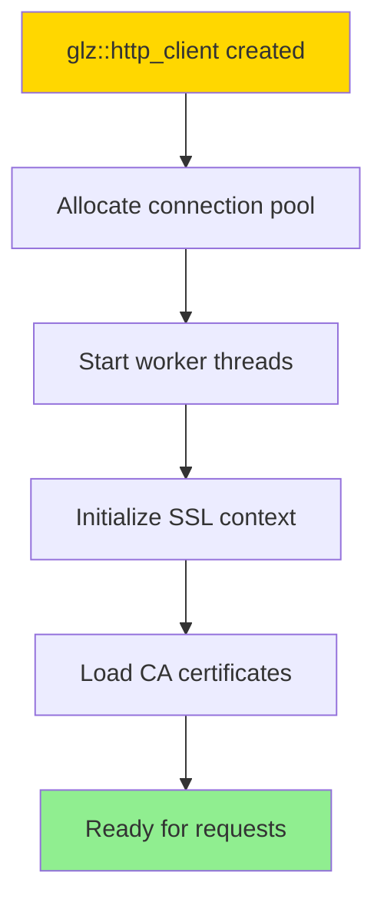
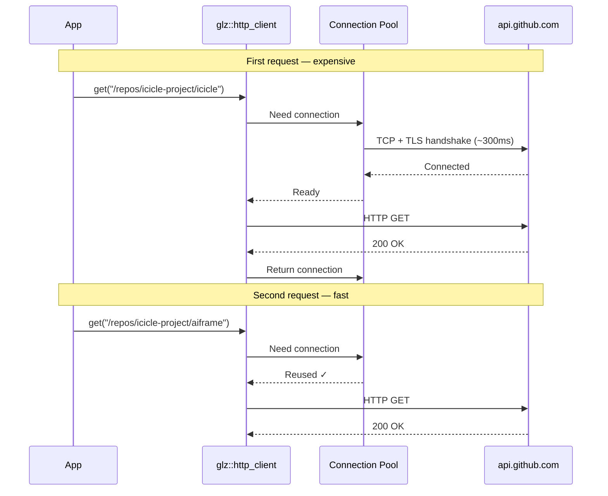
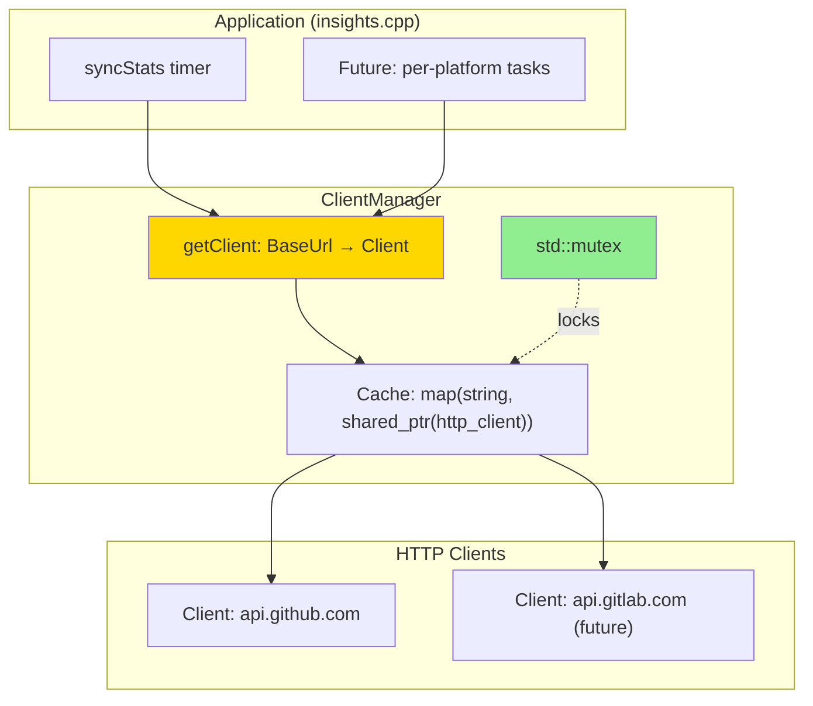

# HTTP Client Guide

This guide walks you through building a production-ready HTTP client system for the `github/tasks` module —
from a simple one-shot client all the way to a cached, reusable manager.

## Learning Goals

- Understand why HTTP clients are expensive to create
- Use Glaze's built-in SSL setup (`configure_system_ca_certificates`)
- Cache clients by base URL to reuse connection pools
- Pass smart pointers efficiently (by `const&`)
- Understand lambda scope rules and why they bite you here
- Write thread-safe code with `std::mutex` + `std::lock_guard`

---

## Background: Why HTTP Clients Are Expensive

### What Happens When You Call `glz::http_client()`



**Cost breakdown:**

| Step | Typical cost |
|---|---|
| SSL context + CA cert loading | 50–200ms |
| Thread creation | OS scheduling overhead |
| Connection pool init | Memory + file descriptors |
| First TLS handshake | 100–300ms |

**Bottom line:** Creating a new client per-request is **10–100× slower** than reusing one.

### Connection Reuse in Action



---

## Step 1: Create a Single Client

This is the foundation used in `src/github/tasks.cpp`.

### SSL Configuration: The Right Way

Glaze provides a one-liner that handles platform differences automatically:

```cpp
// src/github/tasks.cpp
static std::expected<std::shared_ptr<glz::http_client>, core::Error>
createClient() {
  auto Client = std::make_shared<glz::http_client>();

  auto Ok = Client->configure_system_ca_certificates();
  if (!Ok) {
    spdlog::error("Could not find CA certificates");
    return std::unexpected(core::Error{"Could not find CA certificates"});
  }

  return Client;
}
```

`configure_system_ca_certificates()` searches platform-specific locations automatically:

| Platform | Certificate location |
|---|---|
| macOS | System Keychain + Homebrew bundle |
| Ubuntu/Debian | `/etc/ssl/certs/ca-certificates.crt` |
| RHEL/Fedora | `/etc/pki/tls/certs/ca-bundle.crt` |

> **Why not the manual ASIO approach?**
> An older pattern manually called `Ctx.load_verify_file()` and
> `Ctx.set_verify_mode(asio::ssl::verify_peer)`. This requires hardcoding
> cert paths per OS and importing `<asio/ssl.hpp>`. The Glaze helper
> does all of this for you — prefer it.

### Lambda Scope Pitfall (Critical!)

A common mistake when configuring SSL is trying to propagate errors from inside a callback lambda:

```cpp
// ❌ WRONG — compile error or silent UB
Client->configure_ssl_context([](auto& Ctx) {
  std::error_code Ec;
  Ctx.load_verify_file("/path/to/certs", Ec);
  if (Ec) {
    return std::unexpected(core::Error{Ec.message()});  // BUG!
    // The callback signature is void(ssl::context&).
    // You cannot return std::unexpected from a void lambda.
  }
});
```

The callback's return type is `void` — it's independent of the enclosing function's
return type. Trying to `return std::unexpected(...)` from it is a type error
(or in some compilers, silently discarded undefined behavior).

```cpp
// ✅ CORRECT — log the error, don't return from the lambda
Client->configure_ssl_context([](auto& Ctx) {
  std::error_code Ec;
  Ctx.load_verify_file("/path/to/certs", Ec);
  if (Ec) {
    spdlog::warn("SSL cert load failed: {}", Ec.message());
    // Just continue — don't try to propagate via return
  }
});
```

This rule applies to any callback passed to a framework or C API:
**the callback's signature is the contract**, not the enclosing function's.

---

## Step 2: Using the Client in a Task

Here is how `updateRepositories` in `tasks.cpp` receives and uses the client.

### Pass `shared_ptr` by `const&`

```cpp
// include/insights/github/tasks.hpp

// ❌ Copies the shared_ptr (atomic ref-count increment on every call)
auto updateRepositories(
    std::shared_ptr<glz::http_client> Client, ...) -> ...;

// ✅ Reference — no copy, no atomic operation
auto updateRepositories(
    const std::shared_ptr<glz::http_client>& Client, ...) -> ...;
```

The rule of thumb: pass `shared_ptr` by value only when you intend to
*extend the lifetime* of the object (store it or transfer ownership).
For read-only use within a function body, `const&` is always cheaper.

### Making Requests and Handling Errors

```cpp
// src/github/tasks.cpp
auto updateRepositories(
    const std::shared_ptr<glz::http_client>& Client,
    db::Database& Database,
    const core::Config& Config
) -> std::expected<void, core::Error> {

  std::unordered_map<std::string, std::string> Headers = {
      {"Accept",               "application/vnd.github+json"},
      {"Authorization",        std::format("Bearer {}", Config.GitHubToken)},
      {"User-Agent",           "ICICLE-Insights"},
      {"X-GitHub-Api-Version", "2022-11-28"},
  };

  // Fetch all repositories from DB, then sync each one
  auto Repos = Database.getAll<github::models::Repository>();
  if (!Repos) {
    return std::unexpected(Repos.error());
  }

  for (auto& Repo : *Repos) {
    auto Account = Database.get<github::models::Account>(Repo.AccountId);
    if (!Account) continue;  // skip if account missing

    std::string Url = std::format(
        "https://api.github.com/repos/{}/{}", Account->Name, Repo.Name);

    auto Response = Client->get(Url, Headers);
    if (!Response) {
      spdlog::error("GET {} failed: {}", Url, Response.error().message());
      continue;  // log and skip rather than aborting the whole batch
    }

    responses::GitHubRepoStatsResponse Stats{};
    auto ParseError = glz::read<glz::opts{.error_on_unknown_keys = false}>(
        Stats, Response->response_body);
    if (ParseError) {
      spdlog::error("Parse failed: {}",
                    glz::format_error(ParseError, Response->response_body));
      continue;
    }

    Repo.Stars       = Stats.stargazers_count;
    Repo.Forks       = Stats.forks_count;
    Repo.Subscribers = Stats.subscribers_count;

    if (auto DbRes = Database.update(Repo); !DbRes) {
      spdlog::error("DB update failed for {}: {}", Repo.Name, DbRes.error().Message);
    }
  }

  return {};
}
```

> **Design note:** The loop uses `continue` on partial failures rather than
> returning early. This is intentional for a background sync job — one bad
> repo shouldn't abort the rest of the batch. An HTTP API endpoint, by
> contrast, would want to fail fast and return an error to the caller.

---

## Step 3: The Orchestrator (`syncStats`)

`syncStats` is the entry point called by the cron scheduler in `insights.cpp`.
It owns the client lifetime and sequences the pipeline:

```cpp
// src/github/tasks.cpp
auto syncStats(db::Database& Database, const core::Config& Config)
    -> std::expected<void, core::Error> {

  auto ClientResult = createClient();
  if (!ClientResult) {
    return std::unexpected(ClientResult.error());
  }
  auto Client = *ClientResult;  // shared_ptr<glz::http_client>

  // Pipeline: Repos → Accounts → (future: Platforms)
  auto RepoResult = updateRepositories(Client, Database, Config);
  if (!RepoResult) {
    return RepoResult;
  }

  return updateAccounts(Database, Config);
}
```

For a **bi-weekly sync** this is perfectly efficient — the client is created
once, used for the whole sync run, then destroyed when `syncStats` returns.
The connection pool lives only as long as the sync itself.

---

## Step 4: Client Caching (When You Need It)

If your sync runs frequently (every minute) or you have multiple
concurrent callers, recreating the client each call becomes wasteful.
This is when a `ClientManager` makes sense.

### When to Cache

| Sync cadence | Recommendation |
|---|---|
| Hourly / daily / weekly | One client per `syncStats` call is fine |
| Every minute | Cache across calls — saves ~200ms per run |
| Multiple concurrent threads | Cache with a mutex |

### The `ClientManager` Design



### Implementation: Header

Create `include/insights/github/client_manager.hpp`:

```cpp
#pragma once
#include "insights/core/result.hpp"
#include "glaze/net/http_client.hpp"
#include <expected>
#include <memory>
#include <mutex>
#include <string>
#include <unordered_map>

namespace insights::github {

// Caches glz::http_client instances by base URL.
// Thread-safe: safe to call getClient() from multiple threads.
//
// Lifetime: create at application scope (e.g. in main()) so the
// cache persists across sync runs.
class ClientManager {
public:
  ClientManager() = default;

  // Non-copyable: copying would duplicate the cache and break sharing.
  ClientManager(const ClientManager&)            = delete;
  ClientManager& operator=(const ClientManager&) = delete;

  // Movable.
  ClientManager(ClientManager&&) noexcept            = default;
  ClientManager& operator=(ClientManager&&) noexcept = default;

  // Returns a cached client for BaseUrl, or creates one if not present.
  // Thread-safe.
  std::expected<std::shared_ptr<glz::http_client>, core::Error>
  getClient(const std::string& BaseUrl);

  size_t cacheSize() const;
  void   clearCache();

private:
  std::expected<std::shared_ptr<glz::http_client>, core::Error>
  makeClient() const;

  std::unordered_map<std::string, std::shared_ptr<glz::http_client>> Cache_;
  mutable std::mutex Mutex_;
};

} // namespace insights::github
```

**Key design decisions:**

- **Deleted copy constructor** — copying would give two managers with independent
  caches, defeating the purpose. Making it explicit turns a silent bug into a compile error.
- **`mutable std::mutex`** — allows `cacheSize()` to be `const` while still
  taking the lock. The mutex is not part of the logical state.
- **`shared_ptr` return** — callers get shared ownership. The client stays
  alive even if `clearCache()` is called while a request is in flight.

### Implementation: Source

Create `src/github/client_manager.cpp`:

```cpp
#include "insights/github/client_manager.hpp"
#include <spdlog/spdlog.h>

namespace insights::github {

std::expected<std::shared_ptr<glz::http_client>, core::Error>
ClientManager::getClient(const std::string& BaseUrl) {
  std::lock_guard Lock(Mutex_);

  auto It = Cache_.find(BaseUrl);
  if (It != Cache_.end()) {
    spdlog::debug("ClientManager: reusing client for {}", BaseUrl);
    return It->second;
  }

  spdlog::debug("ClientManager: creating client for {}", BaseUrl);
  auto Result = makeClient();
  if (!Result) {
    return Result;
  }

  Cache_[BaseUrl] = *Result;
  return *Result;
}

std::expected<std::shared_ptr<glz::http_client>, core::Error>
ClientManager::makeClient() const {
  auto Client = std::make_shared<glz::http_client>();

  auto Ok = Client->configure_system_ca_certificates();
  if (!Ok) {
    return std::unexpected(core::Error{"Could not find CA certificates"});
  }

  return Client;
}

size_t ClientManager::cacheSize() const {
  std::lock_guard Lock(Mutex_);
  return Cache_.size();
}

void ClientManager::clearCache() {
  std::lock_guard Lock(Mutex_);
  spdlog::info("ClientManager: clearing {} cached clients", Cache_.size());
  Cache_.clear();
}

} // namespace insights::github
```

**`std::lock_guard` primer:**

```cpp
{
  std::lock_guard Lock(Mutex_);  // Lock acquired here (RAII)
  // ... critical section ...
}                                // Lock released automatically — even on exception
```

This is the C++ RAII pattern applied to mutexes. The destructor always runs,
so you can never forget to unlock.

### Using the Manager in `syncStats`

Update `syncStats` to accept a manager:

```cpp
// src/github/tasks.cpp
auto syncStats(
    ClientManager& Mgr,
    db::Database& Database,
    const core::Config& Config
) -> std::expected<void, core::Error> {

  auto ClientResult = Mgr.getClient("https://api.github.com");
  if (!ClientResult) {
    return std::unexpected(ClientResult.error());
  }

  auto RepoResult = updateRepositories(*ClientResult, Database, Config);
  if (!RepoResult) return RepoResult;

  return updateAccounts(Database, Config);
}
```

### Registering in `insights.cpp`

```cpp
// src/insights.cpp
insights::github::ClientManager GitHubClients;

// In the timer callback:
auto Result = insights::github::tasks::syncStats(
    GitHubClients, *TasksDatabase, *Config);
```

The manager lives at application scope, so the cache survives between
timer firings.

---

## Common Pitfalls

### Pitfall 1: Manager Created Inside the Timer Callback

```cpp
// ❌ Cache is destroyed at end of each timer firing — no reuse!
OnTimer = [&](auto Self) {
  github::ClientManager Mgr;                // created every 2 weeks
  tasks::syncStats(Mgr, Database, Config);  // client cached...
};                                          // ...then Mgr destroyed

// ✅ Manager lives outside the lambda
github::ClientManager Mgr;  // application scope
OnTimer = [&](auto Self) {
  tasks::syncStats(Mgr, Database, Config);  // cache persists
};
```

### Pitfall 2: Passing `shared_ptr` by Value in a Hot Path

```cpp
// ❌ Atomic increment + decrement on every call
void doWork(std::shared_ptr<glz::http_client> Client);

// ✅ Just a reference — no atomic ops, same safety
void doWork(const std::shared_ptr<glz::http_client>& Client);
```

### Pitfall 3: Returning from a Void Callback

```cpp
// ❌ Tries to return std::unexpected from a void lambda → UB / compile error
Client->configure_ssl_context([](auto& Ctx) {
  if (error) return std::unexpected(core::Error{"..."});
});

// ✅ Log and continue
Client->configure_ssl_context([](auto& Ctx) {
  if (error) spdlog::warn("...");
});
```

---

## Async Migration Path

The `ClientManager` design requires **no changes** to migrate to async —
only the call sites change:

```cpp
// Current (sync)
auto Response = Client->get(Url, Headers);

// Future (async coroutine)
auto Response = co_await Client->async_get(Url, Headers, asio::use_awaitable);
```

The manager, the cache map, and the mutex remain identical.

---

## Summary

| Topic | Key takeaway |
|---|---|
| SSL setup | Use `configure_system_ca_certificates()` — no manual ASIO |
| `shared_ptr` passing | `const&` unless you need to extend lifetime |
| Lambda return types | Callback signature is the contract — never return Result from void |
| Caching | One client per base URL; cache at application scope |
| Thread safety | `std::lock_guard` + `std::mutex` — RAII prevents forgotten unlocks |
| When to cache | Minute-level sync or concurrent callers; bi-weekly is fine without |
