# HTTP Client Management Guide

This guide walks you through implementing an efficient, production-ready HTTP client system with caching, async support, and proper SSL configuration.

## Learning Goals

- Understand why HTTP clients are expensive to create
- Implement client caching by base URL
- Design for async/await migration
- Handle SSL certificate configuration properly
- Write thread-safe code for concurrent requests
- Avoid common pitfalls (lambda scope issues, memory leaks)

## Background: Why Client Caching Matters

### HTTP Client Lifecycle

When you create an `glz::http_client`:


**Cost breakdown:**
- **Connection pool**: 50-200ms to initialize
- **Worker threads**: Thread creation overhead
- **SSL context**: Certificate parsing and validation
- **Memory**: 100KB-1MB per client

**Bottom line:** Creating a new client for each request is **100-1000x slower** than reusing one.

### Connection Reuse Benefits

```mermaid
sequenceDiagram
    participant App
    participant Client
    participant Pool as Connection Pool
    participant Server as api.github.com

    Note over App,Server: First Request
    App->>Client: get("/repos/...")
    Client->>Pool: Need connection
    Pool->>Server: TCP handshake
    Server-->>Pool: Connected
    Pool->>Server: TLS handshake
    Server-->>Pool: TLS ready
    Pool-->>Client: Connection ready
    Client->>Server: HTTP GET
    Server-->>Client: 200 OK
    Client->>Pool: Return connection

    Note over App,Server: Second Request (FAST!)
    App->>Client: get("/orgs/...")
    Client->>Pool: Need connection
    Pool-->>Client: Reused connection ✓
    Client->>Server: HTTP GET
    Server-->>Client: 200 OK
```



**With caching:**
- 🚀 **First request**: 500ms (connection setup + request)
- 🚀 **Second request**: 50ms (reused connection)
- 🚀 **HTTP/2 multiplexing**: Multiple requests on same connection

**Without caching:**
- 🐌 **Every request**: 500ms (new connection each time)

## Current Problem Analysis

Let's look at the issues in your current code:

### Issue 1: No Client Caching

```cpp
// src/git/tasks.cpp (current - BAD)
std::expected<void, core::Error> runAll(...) {
  auto ClientResult = createClient(Config);  // ❌ Creates new client every time!
  auto Client = ClientResult.value();

  updateRepositories(Client, ...);  // Uses client
  // Client destroyed here - connection pool wasted
}
```

**Problem:** Every call to `runAll()` creates a brand new client, discarding the connection pool.

### Issue 2: Inefficient Parameter Passing

```cpp
// include/git/tasks.hpp (current - BAD)
std::expected<void, core::Error> updateRepositories(
    std::shared_ptr<glz::http_client> Client,  // ❌ Copies the shared_ptr
    std::string RepoId,  // ❌ Copies the string
    std::string Token,   // ❌ Copies the string
    db::Database& Database,
    const core::Config& Config);  // ❌ Config not even used!
```

**Problems:**
- `shared_ptr` copy = atomic increment/decrement (slow)
- String copies = memory allocation + copy
- Unused `Config` parameter

### Issue 3: Lambda Scope Bug (Critical!)

```cpp
// src/git/tasks.cpp:16-39 (FIXED, but let's understand the bug)

// WRONG (old code):
Client->configure_ssl_context([&Config](auto &Ctx) {
  // ...
  if (Ec) {
    spdlog::warn("...");
    return std::unexpected<core::Error>(Ec.message());  // ❌ BUG!
  }
  // ...
});

// Problem: Lambda returns core::Error, but SSL callback expects void
// This corrupts the stack and causes SIGTRAP crash!
```

**Fixed version:**
```cpp
Client->configure_ssl_context([&Config](auto &Ctx) {
  // ...
  if (Ec) {
    spdlog::warn("...");
    // Just log and continue - don't return from the lambda!
  }
  // ...
});
```

**Lesson:** Lambdas have their own return type, separate from the outer function. Trying to `return` a `Result<T>` from a void callback is undefined behavior.

## Solution: HTTP Client Manager

### Design Overview


### Implementation Steps

## Step 1: Create the Header

Create `include/git/http_client_manager.hpp`:

```cpp
#pragma once
#include "core/config.hpp"
#include "core/result.hpp"
#include "glaze/net/http_client.hpp"
#include <expected>
#include <memory>
#include <mutex>
#include <string>
#include <unordered_map>

namespace insights::git {

/**
 * Manages HTTP client instances with caching by base URL.
 *
 * Thread-safe: Can be called from multiple threads concurrently.
 *
 * Usage:
 *   HttpClientManager Manager(Config);
 *   auto Client = Manager.getClient("https://api.github.com");
 *   auto Response = Client->get("/repos/...", Headers);
 */
class HttpClientManager {
public:
  explicit HttpClientManager(const core::Config& Config);

  // Prevent copying (would duplicate cache)
  HttpClientManager(const HttpClientManager&) = delete;
  HttpClientManager& operator=(const HttpClientManager&) = delete;

  // Allow moving
  HttpClientManager(HttpClientManager&&) noexcept = default;
  HttpClientManager& operator=(HttpClientManager&&) noexcept = default;

  /**
   * Get or create an HTTP client for the given base URL.
   *
   * @param BaseUrl The base URL (e.g., "https://api.github.com")
   * @return Shared pointer to client (cached for reuse)
   *
   * Thread-safe: Multiple threads can call this concurrently.
   *
   * Example:
   *   auto Client = Manager.getClient("https://api.github.com");
   *   if (!Client) {
   *     spdlog::error("Failed to create client: {}", Client.error().Message);
   *     return;
   *   }
   *   auto Response = (*Client)->get("/users/octocat", Headers);
   */
  std::expected<std::shared_ptr<glz::http_client>, core::Error>
  getClient(const std::string& BaseUrl);

  /**
   * Get the number of cached clients.
   * Useful for monitoring/debugging.
   */
  size_t getCacheSize() const;

  /**
   * Clear all cached clients.
   * Use when changing SSL configuration at runtime.
   */
  void clearCache();

private:
  /**
   * Create a new HTTP client with SSL configuration from Config.
   */
  std::expected<std::shared_ptr<glz::http_client>, core::Error>
  createClient();

  const core::Config& Config_;
  std::unordered_map<std::string, std::shared_ptr<glz::http_client>> Clients_;
  mutable std::mutex Mutex_;  // Thread safety
};

} // namespace insights::git
```

**Key design decisions:**

1. **`const core::Config&`** - Reference avoids copy, `const` guarantees immutability
2. **`std::mutex`** - Thread-safe for async/concurrent access
3. **`std::shared_ptr`** - Multiple callers can hold references to the same client
4. **Deleted copy constructor** - Prevents accidental cache duplication
5. **`mutable` mutex** - Allows locking in `const` methods like `getCacheSize()`

## Step 2: Implement the Source

Create `src/git/http_client_manager.cpp`:

```cpp
#include "git/http_client_manager.hpp"
#include <asio/ssl.hpp>
#include <spdlog/spdlog.h>
#include <system_error>

namespace insights::git {

HttpClientManager::HttpClientManager(const core::Config& Config)
    : Config_(Config) {
  spdlog::debug("HttpClientManager created");
}

std::expected<std::shared_ptr<glz::http_client>, core::Error>
HttpClientManager::getClient(const std::string& BaseUrl) {
  // Lock for thread safety
  std::lock_guard<std::mutex> Lock(Mutex_);

  // Check if client already exists in cache
  auto It = Clients_.find(BaseUrl);
  if (It != Clients_.end()) {
    spdlog::debug("Reusing cached HTTP client for: {}", BaseUrl);
    return It->second;
  }

  // Create new client
  spdlog::debug("Creating new HTTP client for: {}", BaseUrl);
  auto ClientResult = createClient();
  if (!ClientResult) {
    return ClientResult;
  }

  // Cache it for future use
  Clients_[BaseUrl] = *ClientResult;
  spdlog::info("HTTP client created and cached for: {}", BaseUrl);

  return *ClientResult;
}

std::expected<std::shared_ptr<glz::http_client>, core::Error>
HttpClientManager::createClient() {
  auto Client = std::make_shared<glz::http_client>();

  // Configure SSL to use system certificates
  Client->configure_ssl_context([this](auto& Ctx) {
    std::error_code Ec;

    // Try custom SSL_CERT_FILE from config if set
    if (Config_.SslCertFile) {
      Ctx.load_verify_file(*Config_.SslCertFile, Ec);
      if (Ec) {
        spdlog::warn("Failed to load CA certificates from SSL_CERT_FILE ({}): {}",
                     *Config_.SslCertFile, Ec.message());
      } else {
        spdlog::debug("Loaded CA certificates from: {}", *Config_.SslCertFile);
      }
    }

    // Fall back to system default paths if not set or failed
    if (!Config_.SslCertFile || Ec) {
      Ctx.set_default_verify_paths(Ec);
      if (Ec) {
        spdlog::warn("Failed to set default verify paths: {}", Ec.message());
        // Continue anyway - some systems have certs in non-standard locations
      } else {
        spdlog::debug("Using system default CA certificate paths");
      }
    }

    // Always verify peer (enforce HTTPS security)
    Ctx.set_verify_mode(asio::ssl::verify_peer);
  });

  return Client;
}

size_t HttpClientManager::getCacheSize() const {
  std::lock_guard<std::mutex> Lock(Mutex_);
  return Clients_.size();
}

void HttpClientManager::clearCache() {
  std::lock_guard<std::mutex> Lock(Mutex_);
  spdlog::info("Clearing HTTP client cache ({} clients)", Clients_.size());
  Clients_.clear();
}

} // namespace insights::git
```

**Implementation notes:**

1. **`std::lock_guard`** - RAII mutex locking (automatic unlock on scope exit)
2. **Lambda capture `[this]`** - Captures the manager instance (safe because Config_ is a reference)
3. **Error logging** - SSL errors are logged but don't fail client creation (graceful degradation)
4. **Cache invalidation** - `clearCache()` for runtime config changes

## Step 3: Update Task Functions

Update `include/git/tasks.hpp`:

```cpp
#pragma once
#include "core/config.hpp"
#include "db/db.hpp"
#include "git/http_client_manager.hpp"  // ✅ Add this
#include "glaze/net/http_client.hpp"
#include <expected>
#include <string>

namespace insights::git::tasks {

// ✅ Efficient parameters: const ref for shared_ptr
std::expected<void, core::Error> updateRepositories(
    const std::shared_ptr<glz::http_client>& Client,  // ✅ Pass by const ref
    const std::string& RepoId,  // ✅ const ref avoids copy
    const std::string& Token,   // ✅ const ref avoids copy
    db::Database& Database);    // ✅ Removed unused Config

std::expected<void, core::Error> updateAccounts(db::Database& Database);
std::expected<void, core::Error> updatePlatforms(db::Database& Database);

// ✅ Take ClientManager instead of Config
std::expected<void, core::Error> runAll(
    HttpClientManager& ClientMgr,  // ✅ Pass manager
    const std::string& RepoId,
    const std::string& Token,
    db::Database& Database);

} // namespace insights::git::tasks
```

Update `src/git/tasks.cpp`:

```cpp
#include "git/tasks.hpp"
#include "git/models.hpp"
#include <expected>
#include <format>
#include <spdlog/spdlog.h>

namespace insights::git::tasks {

std::expected<void, core::Error> updateRepositories(
    const std::shared_ptr<glz::http_client>& Client,  // ✅ const ref
    const std::string& RepoId,
    const std::string& Token,
    db::Database& Database) {

  std::unordered_map<std::string, std::string> Headers = {
      {"Accept", "application/vnd.github+json"},
      {"Authorization", std::format("Bearer {}", Token)},
      {"User-Agent", "ICICLE-Insights"},
      {"X-GitHub-Api-Version", "2022-11-28"},
  };

  auto DbGetRepoRes = Database.get<git::models::Repository>(RepoId);
  if (!DbGetRepoRes) {
    return std::unexpected(core::Error{"Repository not found"});
  }

  auto Repository = DbGetRepoRes.value();

  auto DbGetAccountRes = Database.get<git::models::Account>(Repository.AccountId);
  if (!DbGetAccountRes) {
    return std::unexpected(core::Error{"Account not found"});
  }

  auto Account = DbGetAccountRes.value();

  std::string Url = std::format("https://api.github.com/repos/{}/{}",
                                Account.Name, Repository.Name);

  // ✅ Null check (defensive programming)
  if (!Client) {
    return std::unexpected(core::Error{"HTTP Client is null"});
  }

  spdlog::debug("Making HTTP GET request to: {}", Url);

  auto Response = Client->get(Url, Headers);
  if (!Response) {
    std::string ErrorMsg = std::format("HTTP request failed: {}",
                                       Response.error().message());
    spdlog::error(ErrorMsg);
    return std::unexpected(core::Error{ErrorMsg});
  }

  spdlog::info("Fetched repository data: {} bytes", Response->response_body.size());

  // TODO: Parse JSON and update database
  // glz::read_json(Repository, Response->response_body);
  // Database.update(Repository);

  return {};
}

std::expected<void, core::Error> updateAccounts(db::Database& Database) {
  // TODO: Aggregate repository data to account level
  return {};
}

std::expected<void, core::Error> updatePlatforms(db::Database& Database) {
  // TODO: Aggregate account/repository data to platform level
  return {};
}

std::expected<void, core::Error> runAll(
    HttpClientManager& ClientMgr,  // ✅ Manager instead of Config
    const std::string& RepoId,
    const std::string& Token,
    db::Database& Database) {

  // ✅ Get cached or create client for GitHub API
  auto ClientResult = ClientMgr.getClient("https://api.github.com");
  if (!ClientResult) {
    return std::unexpected(ClientResult.error());
  }

  // ✅ Client is cached - future calls reuse it!
  auto Client = *ClientResult;

  // Run the pipeline
  auto RepoResult = updateRepositories(Client, RepoId, Token, Database);
  if (!RepoResult) {
    return RepoResult;
  }

  auto AccountResult = updateAccounts(Database);
  if (!AccountResult) {
    return AccountResult;
  }

  return updatePlatforms(Database);
}

} // namespace insights::git::tasks
```

## Step 4: Update CMakeLists.txt

Add the new source file:

```cmake
add_executable(icicle-insights
    src/insights.cpp
    src/git/router.cpp
    src/git/tasks.cpp
    src/git/http_client_manager.cpp  # ✅ Add this line
    src/server/server.cpp
    # ... other sources
)
```

## Step 5: Update insights.cpp

Update `src/insights.cpp` to create the manager:

```cpp
#include "git/http_client_manager.hpp"
#include "git/tasks.hpp"
// ... other includes

int main() {
  auto Config = insights::core::Config::load();
  if (!Config) {
    spdlog::error(Config.error().Message);
    return 1;
  }

  auto Database = insights::db::Database::connect(Config->DatabaseUrl);
  if (!Database) {
    spdlog::error(Database.error().Message);
    return 1;
  }

  // ✅ Create HTTP client manager (single instance)
  insights::git::HttpClientManager ClientMgr(*Config);

  // ✅ Pass manager to tasks
  auto TasksResult = insights::git::tasks::runAll(
      ClientMgr,  // Manager handles caching
      "49d9c81c-54a7-4c47-8b24-10d4cfbc7b7a",
      Config->GitHubToken,
      *Database.value());

  if (!TasksResult) {
    spdlog::error("Tasks failed: {}", TasksResult.error().Message);
  } else {
    spdlog::info("Tasks completed successfully!");
  }

  // ✅ Manager automatically cleans up cached clients on destruction

  return 0;
}
```

## Async Migration Path

When you're ready to add async support, the manager design makes it easy:

### Phase 1: Async Tasks (Future)

```cpp
// Use glaze's async API
asio::awaitable<std::expected<void, core::Error>> updateRepositoriesAsync(
    const std::shared_ptr<glz::http_client>& Client,
    const std::string& RepoId,
    const std::string& Token,
    db::Database& Database) {

  // ... setup ...

  // ✅ Async GET with co_await
  auto Response = co_await Client->async_get(Url, Headers, asio::use_awaitable);

  if (!Response) {
    co_return std::unexpected(core::Error{Response.error().message()});
  }

  // ... process response ...

  co_return {};
}
```

### Phase 2: Coroutine-based Pipeline

```cpp
asio::awaitable<std::expected<void, core::Error>> runAllAsync(
    HttpClientManager& ClientMgr,
    const std::string& RepoId,
    const std::string& Token,
    db::Database& Database) {

  auto ClientResult = ClientMgr.getClient("https://api.github.com");
  if (!ClientResult) {
    co_return std::unexpected(ClientResult.error());
  }
  auto Client = *ClientResult;

  // ✅ Sequential async operations (non-blocking)
  auto Repo = co_await updateRepositoriesAsync(Client, RepoId, Token, Database);
  if (!Repo) co_return Repo;

  auto Acct = co_await updateAccountsAsync(Database);
  if (!Acct) co_return Acct;

  auto Plat = co_await updatePlatformsAsync(Database);
  co_return Plat;
}
```

## Testing

### Unit Test Example

```cpp
// tests/http_client_manager_test.cpp
#include "git/http_client_manager.hpp"
#include <gtest/gtest.h>

TEST(HttpClientManager, CachesClientsByBaseUrl) {
  core::Config Config{/* mock config */};
  git::HttpClientManager Manager(Config);

  // First call creates client
  auto Client1 = Manager.getClient("https://api.github.com");
  ASSERT_TRUE(Client1.has_value());
  EXPECT_EQ(Manager.getCacheSize(), 1);

  // Second call reuses cached client
  auto Client2 = Manager.getClient("https://api.github.com");
  ASSERT_TRUE(Client2.has_value());
  EXPECT_EQ(Manager.getCacheSize(), 1);  // Still 1

  // Same client instance
  EXPECT_EQ(Client1->get(), Client2->get());

  // Different base URL creates new client
  auto Client3 = Manager.getClient("https://api.gitlab.com");
  ASSERT_TRUE(Client3.has_value());
  EXPECT_EQ(Manager.getCacheSize(), 2);
}

TEST(HttpClientManager, ThreadSafe) {
  core::Config Config{/* mock config */};
  git::HttpClientManager Manager(Config);

  // Launch multiple threads requesting clients
  std::vector<std::thread> Threads;
  for (int i = 0; i < 10; ++i) {
    Threads.emplace_back([&]() {
      auto Client = Manager.getClient("https://api.github.com");
      EXPECT_TRUE(Client.has_value());
    });
  }

  for (auto& Thread : Threads) {
    Thread.join();
  }

  // Only one client should be created despite 10 concurrent requests
  EXPECT_EQ(Manager.getCacheSize(), 1);
}
```

## Performance Comparison

```cpp
// Benchmark: Create new client every time vs. cached
void BM_NewClientEachTime(benchmark::State& state) {
  core::Config Config{/* ... */};

  for (auto _ : state) {
    auto Client = createClient(Config);  // Slow!
    auto Response = Client->get("https://api.github.com/users/octocat", {});
    benchmark::DoNotOptimize(Response);
  }
}
BENCHMARK(BM_NewClientEachTime);  // ~500ms per iteration

void BM_CachedClient(benchmark::State& state) {
  core::Config Config{/* ... */};
  git::HttpClientManager Manager(Config);
  auto Client = *Manager.getClient("https://api.github.com");

  for (auto _ : state) {
    auto Response = Client->get("/users/octocat", {});
    benchmark::DoNotOptimize(Response);
  }
}
BENCHMARK(BM_CachedClient);  // ~50ms per iteration (10x faster!)
```

## Common Pitfalls and Solutions

### Pitfall 1: Client Destroyed Too Early

```cpp
// ❌ BAD
std::expected<void, core::Error> doWork() {
  HttpClientManager Manager(Config);
  auto Client = *Manager.getClient("...");

  // Client is a shared_ptr to the client in Manager's cache
  return;  // Manager destroyed, Client cache destroyed!
}

// Next call to doWork() creates new manager and new client (no caching!)
```

**Solution:** Create manager at application scope:

```cpp
// ✅ GOOD
class Application {
  git::HttpClientManager ClientMgr;  // Lives for app lifetime

public:
  Application(const core::Config& Config) : ClientMgr(Config) {}

  void doWork() {
    auto Client = *ClientMgr.getClient("...");
    // Client reused across multiple calls
  }
};
```

### Pitfall 2: Passing Clients Incorrectly

```cpp
// ❌ BAD
void updateRepos(std::shared_ptr<glz::http_client> Client) {
  // Copies shared_ptr (atomic increment)
}

// ✅ GOOD
void updateRepos(const std::shared_ptr<glz::http_client>& Client) {
  // No copy, just a reference
}
```

### Pitfall 3: Lambda Return Type Confusion

```cpp
// ❌ WRONG
Client->configure_ssl_context([](auto& Ctx) {
  if (error) {
    return std::unexpected<Error>("Failed");  // CRASH! Lambda expects void
  }
});

// ✅ CORRECT
Client->configure_ssl_context([](auto& Ctx) {
  if (error) {
    spdlog::error("Failed");  // Just log, don't return Result
  }
});
```

## Summary

**What you've learned:**

1. ✅ **HTTP clients are expensive** - Cache them by base URL
2. ✅ **Thread safety** - Use `std::mutex` for concurrent access
3. ✅ **Efficient parameters** - Pass `shared_ptr` and strings by const ref
4. ✅ **Lambda scope rules** - Return types must match callback signatures
5. ✅ **Async-ready design** - Manager works with both sync and async APIs
6. ✅ **RAII lifecycle** - Manager cleans up clients automatically

**Next steps:**

1. Implement `HttpClientManager` class
2. Update `tasks.cpp` to use the manager
3. Test with unit tests
4. Monitor cache size in production
5. Add async variants when ready

**Key insight:** Good design today (caching, thread safety) makes async migration tomorrow much easier!
