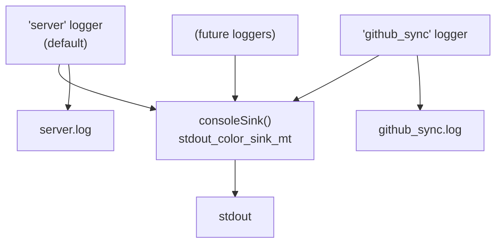

# Logging

ICICLE Insights uses [spdlog](https://github.com/gabime/spdlog) with a
per-component logger model. Each component writes to its own log file while
sharing a single stdout stream.

---

## Environment Variables

| Variable    | Required | Description |
|-------------|----------|-------------|
| `LOG_LEVEL` | No       | Log verbosity: `trace`, `debug`, `info`, `warn`, `error` (default: `info`) |
| `LOG_DIR`   | No       | Directory for log files. Omit to log to stdout only. Created automatically if it does not exist. |

---

## Log Files

When `LOG_DIR` is set, each component writes to its own rotating file:

```
{LOG_DIR}/
  server.log       ← HTTP server: startup, routes, health checks, request logs
  github_sync.log  ← GitHub sync task: API calls, DB updates, errors
```

Each file rotates at **10 MB** and keeps **3** rotated copies (30 MB max per component).

All loggers also write to **stdout** regardless of whether `LOG_DIR` is set,
which means `docker logs` always captures output even without a volume mount.

---

## Setup

`setupLogging` is called once in `main()` after `Config::load()`. It creates
the `server` logger and registers it as the spdlog default:

```cpp
auto Config = insights::core::Config::load();
insights::core::setupLogging(*Config);
```

Each task logger is registered immediately after:

```cpp
insights::core::createLogger("github_sync", *Config);
```

---

## Adding a Logger for a New Task

**1. Register it in `insights.cpp`** alongside the existing task loggers:

```cpp
insights::core::createLogger("my_task", *Config);
```

**2. Add a static accessor in the task's `.cpp` file:**

```cpp
namespace insights::my_module::tasks {

static auto Log() { return spdlog::get("my_task"); }

// All log calls in this file use Log()->info(...), Log()->error(...) etc.
```

That's it — `{LOG_DIR}/my_task.log` is created automatically on the next run.

---

## Architecture

All loggers share a single `stdout_color_sink_mt` instance (via `consoleSink()`
in `logging.hpp`). This avoids interleaved output on the terminal since spdlog
sinks are individually thread-safe.



---

## Docker

Log files are written inside the container. To persist them on the host,
mount the log directory as a volume:

```bash
docker run \
  -e LOG_DIR=/app/logs \
  -v ./logs:/app/logs \
  icicle-insights
```

The `insights` user owns `/app/logs` in the image, so no permission issues.
Without the `-v` mount, logs still write inside the container but are lost
when it stops.
