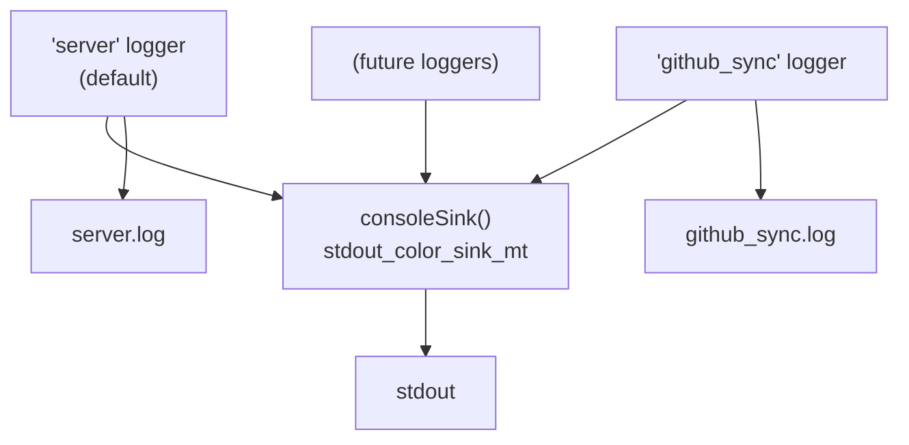

# Logging

ICICLE Insights uses [spdlog](https://github.com/gabime/spdlog) with a
per-component logger model. Each component writes to its own log file while
sharing a single stdout stream.

---

## Environment Variables

| Variable    | Required | Description |
|-------------|----------|-------------|
| `LOG_LEVEL` | No       | Log verbosity: `trace`, `debug`, `info`, `warn`, `error` (default: `info`) |
| `LOG_DIR`   | No       | Directory for log files. Omit to log to stdout only. Created automatically if it does not exist. |

---

## Log Files

When `LOG_DIR` is set, each component writes to its own rotating file:

```
{LOG_DIR}/
  server.log       ← HTTP server: startup, routes, health checks, request logs
  github_sync.log  ← GitHub sync task: API calls, DB updates, errors
```

Each file rotates at **10 MB** and keeps **3** rotated copies (30 MB max per component). These limits exist to bound disk usage on long-running servers — a sync task that logs heavily during a large GitHub crawl won't fill the disk.

All loggers also write to **stdout** regardless of whether `LOG_DIR` is set,
which means `docker logs` always captures output even without a volume mount.

---

## Setup

`setupLogging` and `createLogger` are intentionally separate. `setupLogging` runs once at startup and creates the `server` logger plus the shared stdout sink that all loggers will share. `createLogger` is then used to register additional named loggers, such as `github_sync`, into the same shared sink set. Keeping them separate means the server logger is ready before any task loggers exist, and adding a new task logger never touches the server's setup.

`setupLogging` is called once in `main()` after `Config::load()`. It creates
the `server` logger and registers it as the spdlog default:

```cpp
auto Config = insights::core::Config::load();
insights::core::setupLogging(*Config);
```

Each task logger is registered immediately after:

```cpp
insights::core::createLogger("github_sync", *Config);
```

---

## Adding a Logger for a New Task

**1. Register it in `insights.cpp`** alongside the existing task loggers:

```cpp
insights::core::createLogger("my_task", *Config);
```

**2. Add a static accessor in the task's `.cpp` file:**

```cpp
namespace insights::my_module::tasks {

static auto Log() { return spdlog::get("my_task"); }

// All log calls in this file use Log()->info(...), Log()->error(...) etc.
```

That's it — `{LOG_DIR}/my_task.log` is created automatically on the next run.

Register each logger name once during startup. The current helper unconditionally calls `spdlog::register_logger(...)`, so re-registering the same name later would need additional guarding logic.

---

## Architecture

All loggers share a single `stdout_color_sink_mt` instance (via `consoleSink()` in `logging.hpp`). The `_mt` suffix means "multi-threaded" — the sink holds an internal mutex so concurrent log calls from different threads are serialized. If each logger had its own sink, two threads could write to stdout simultaneously and their output would interleave mid-line. One shared sink prevents that.

Per-component loggers (one per subsystem) give you the ability to tail a single component's output in isolation (`github_sync.log`) without wading through unrelated server traffic — useful when debugging a sync run while the HTTP server is also active.


```mermaid
graph TD
    CS["consoleSink()\nstdout_color_sink_mt"]
    OUT[stdout]
    SL["'server' logger\n(default)"]
    GL["'github_sync' logger"]
    FT["(future loggers)"]
    SF[server.log]
    GF[github_sync.log]

    SL --> CS
    GL --> CS
    FT --> CS
    CS --> OUT
    SL --> SF
    GL --> GF
```

---

## Docker

Log files are written inside the container. To persist them on the host,
mount the log directory as a volume:

```bash
docker run \
  -e LOG_DIR=/app/logs \
  -v ./logs:/app/logs \
  icicle-insights
```

The `insights` user owns `/app/logs` in the image, so no permission issues arise when the container writes files there. Without the `-v` mount, logs still write inside the container but are lost when it stops — which is fine for ephemeral deployments where stdout (`docker logs`) is the primary log stream, but not for production environments where you need log history across restarts.
