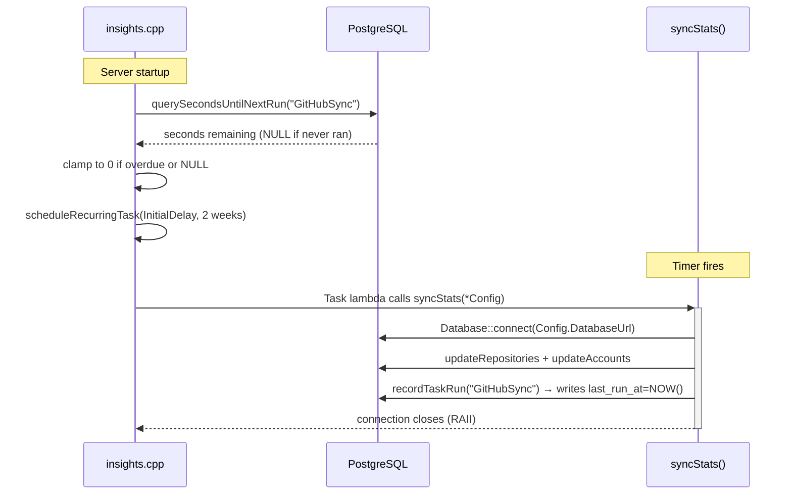

# Task Persistence

**Status: Future Feature**

Persist cron task schedule state to PostgreSQL so the server resumes the correct
firing time after a restart, instead of always triggering immediately on startup.

---

## Problem

`scheduleRecurringTask` always uses whatever `InitialDelay` is passed at startup.
Currently that delay is computed from the current weekday, so every restart
re-computes "days until next Saturday" — which is correct for the first-ever run
but ignores whether the task already ran this cycle.

After implementing this feature, a restart mid-cycle will resume from where it
left off instead of re-firing immediately.

---

## Database Schema

```sql
CREATE TABLE IF NOT EXISTS task_runs (
    task_name   TEXT        PRIMARY KEY,
    last_run_at TIMESTAMPTZ NOT NULL,
    next_run_at TIMESTAMPTZ GENERATED ALWAYS AS (last_run_at + INTERVAL '2 weeks') STORED
);
```

`next_run_at` is a PostgreSQL generated column — the database recomputes it
automatically whenever `last_run_at` is written. No application code needs to
calculate the next fire time.

---

## Overall Flow



### On startup — compute `InitialDelay` from the DB

```cpp
auto DelayResult = ServerDatabase->querySecondsUntilNextRun("GitHubSync");

// Clamp to 0 if overdue; default to 0 on first-ever run (NULL row)
auto SecondsUntilNext = (DelayResult && *DelayResult)
    ? std::max(**DelayResult, 0LL)
    : 0LL;

scheduleRecurringTask(Timer, "GitHubSync",
    std::chrono::seconds(SecondsUntilNext),
    std::chrono::weeks(2), [...]);
```

### After each sync — record `last_run_at`

```cpp
// At the end of syncStats(), after the pipeline succeeds:
Db.recordTaskRun("GitHubSync");
```

Postgres writes `NOW()` to `last_run_at` and regenerates `next_run_at`
automatically.

---

## Implementation Steps

### Step 1 — Add two methods to `db.hpp`

Add to the `Database` struct in `include/insights/db/db.hpp`.

**`recordTaskRun`** — upserts the current timestamp for a named task:

```cpp
std::expected<void, core::Error> recordTaskRun(std::string_view TaskName) {
  try {
    pqxx::work Tx(Cx);
    static constexpr std::string_view Query =
        "INSERT INTO task_runs (task_name, last_run_at) VALUES ($1, NOW()) "
        "ON CONFLICT (task_name) "
        "DO UPDATE SET last_run_at = EXCLUDED.last_run_at";
    Tx.exec(pqxx::zview{Query}, pqxx::params{TaskName});
    Tx.commit();
    return {};
  } catch (const std::exception &Err) {
    spdlog::error("Database::recordTaskRun - Failed: {}", Err.what());
    return std::unexpected(core::Error{Err.what()});
  }
}
```

**`querySecondsUntilNextRun`** — returns seconds until the next scheduled run.
Returns `std::nullopt` if the task has never run (no row yet):

```cpp
std::expected<std::optional<long long>, core::Error>
querySecondsUntilNextRun(std::string_view TaskName) {
  try {
    pqxx::work Tx(Cx);
    static constexpr std::string_view Query =
        "SELECT EXTRACT(EPOCH FROM (next_run_at - NOW()))::bigint "
        "FROM task_runs WHERE task_name = $1";
    auto Res = Tx.exec(pqxx::zview{Query}, pqxx::params{TaskName});
    if (Res.empty()) return std::nullopt;
    return Res[0][0].as<long long>();
  } catch (const std::exception &Err) {
    spdlog::error("Database::querySecondsUntilNextRun - Failed: {}", Err.what());
    return std::unexpected(core::Error{Err.what()});
  }
}
```

`EXTRACT(EPOCH ...)` lets Postgres compute the difference in seconds — a plain
integer that maps directly to `std::chrono::seconds` without any cross-clock
`time_point` conversion.

---

### Step 2 — Update `include/insights/github/tasks.hpp`

Change `syncStats` to take only `Config`. It opens its own DB connection
internally, so the caller no longer needs to maintain a long-lived `TasksDatabase`.

```cpp
// Before:
auto syncStats(db::Database &Database, const core::Config &Config)
    -> std::expected<void, core::Error>;

// After:
auto syncStats(const core::Config &Config)
    -> std::expected<void, core::Error>;
```

---

### Step 3 — Update `src/github/tasks.cpp`

Replace the current `syncStats` with the connection-per-run pattern and add
`recordTaskRun` at the end:

```cpp
auto syncStats(const core::Config &Config) -> std::expected<void, core::Error> {
  // Open a fresh connection for this run — closed automatically at scope exit
  auto DbResult = db::Database::connect(Config.DatabaseUrl);
  if (!DbResult) return std::unexpected(DbResult.error());
  auto &Db = **DbResult;

  auto ClientResult = createClient(Config);
  if (!ClientResult) return std::unexpected(ClientResult.error());

  // Run the pipeline
  if (auto R = updateRepositories(*ClientResult, Db, Config); !R) return R;
  if (auto R = updateAccounts(*ClientResult, Db, Config); !R) return R;

  // Record completion — Postgres regenerates next_run_at automatically
  if (auto R = Db.recordTaskRun("GitHubSync"); !R) {
    Log()->warn("recordTaskRun failed: {}", R.error().Message);
  }

  return {};
}
```

---

### Step 4 — Update `src/insights.cpp`

Replace the weekday-calculation block with a DB-driven delay, and remove the
separate `TasksDatabase` connection entirely:

```cpp
// Replace the current weekday calculation with this:
auto DelayResult = ServerDatabase->querySecondsUntilNextRun("GitHubSync");
auto SecondsUntilNext = (DelayResult && *DelayResult)
    ? std::max(**DelayResult, 0LL)
    : 0LL;
auto InitialDelay = std::chrono::seconds(SecondsUntilNext);

auto GitHubSyncTimer = std::make_shared<asio::steady_timer>(*IOContext);
insights::core::scheduleRecurringTask(
    GitHubSyncTimer,
    "GitHubSync",
    InitialDelay,
    std::chrono::weeks(2),
    [Config] {   // no TasksDatabase capture — task opens its own connection
        insights::github::tasks::syncStats(*Config);
    }
);

// Delete the entire "Register Database Connection for Tasks" block —
// TasksDatabase is no longer needed.
```

---

## Database Connection Strategy

Open a **fresh connection inside `syncStats`** — not a long-lived one held
between timer firings.

| Strategy | Problem |
|----------|---------|
| Persistent `TasksDatabase` held for 2 weeks | TCP keepalive, PgBouncer, or firewall will drop the idle connection; the next use throws mid-sync |
| Connection per run (this approach) | Opens at task start, closes at scope exit; zero idle time |

The overhead of opening a PostgreSQL connection is negligible at a 2-week
interval — connection setup takes a few milliseconds.

---

## Clock Note

`EXTRACT(EPOCH ...)` returns the difference between two `TIMESTAMPTZ` values as
plain seconds. Wrapping that in `std::chrono::seconds(n)` produces a duration
that works with both `steady_clock` and `system_clock` timers. This avoids the
awkward cross-clock `time_point` conversion that would otherwise be needed when
bridging the DB's wall-clock timestamps to ASIO's monotonic timer.
