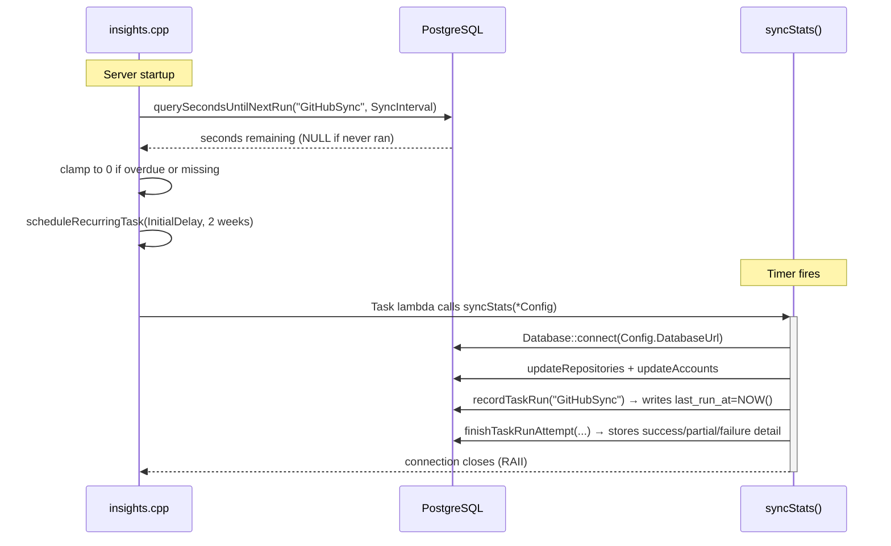

# Task Persistence

**Status: Implemented**

Persist cron task schedule state to PostgreSQL so the server resumes the correct
firing time after a restart, while still running immediately on startup when the
task has never succeeded before or is already overdue by at least the full
two-week interval.

---

## Problem

`scheduleRecurringTask` always uses whatever `InitialDelay` is passed at startup.
Without persistence, every restart would either run immediately or use some
hard-coded rule unrelated to the last successful sync.

After implementing this feature, a restart mid-cycle will resume from where it
left off instead of re-firing too early.

---

## Database Schema

```sql
CREATE TABLE IF NOT EXISTS task_runs (
    task_name   TEXT        PRIMARY KEY,
    last_run_at TIMESTAMPTZ NOT NULL
);

CREATE TABLE IF NOT EXISTS task_run_attempts (
    id BIGSERIAL PRIMARY KEY,
    task_name TEXT NOT NULL,
    started_at TIMESTAMPTZ NOT NULL DEFAULT NOW(),
    finished_at TIMESTAMPTZ,
    status TEXT NOT NULL,
    summary TEXT,
    repositories_processed INT NOT NULL DEFAULT 0,
    repositories_failed INT NOT NULL DEFAULT 0,
    accounts_processed INT NOT NULL DEFAULT 0,
    accounts_failed INT NOT NULL DEFAULT 0
);

CREATE INDEX IF NOT EXISTS idx_task_run_attempts_task_name_started_at
    ON task_run_attempts(task_name, started_at DESC);
```

The scheduling table stays intentionally minimal — one row per named task,
storing only the last successful run. Detailed attempt history lives in
`task_run_attempts`, which captures failed and partial runs without affecting
the next scheduled execution time. There is still no `next_run_at` column
because that would need to be kept in sync with any interval changes. Instead,
the next run time is computed on the fly in SQL:
`(last_run_at + $2::bigint * INTERVAL '1 second')`. The interval is always
passed in at query time from the C++ constant, so changing the interval in code
automatically changes the schedule with no schema migration.

`TIMESTAMPTZ` (timestamp with time zone) is used rather than bare `TIMESTAMP` so Postgres stores the value in UTC and converts correctly regardless of server timezone.

---

## Overall Flow


```mermaid
sequenceDiagram
    participant App as insights.cpp
    participant DB as PostgreSQL
    participant Task as syncStats()

    Note over App: Server startup
    App->>DB: querySecondsUntilNextRun("GitHubSync", SyncInterval)
    DB-->>App: seconds remaining (NULL if never ran)
    App->>App: clamp to 0 if overdue or missing
    App->>App: scheduleRecurringTask(InitialDelay, 2 weeks)

    Note over Task: Timer fires
    App->>+Task: Task lambda calls syncStats(*Config)
    Task->>DB: Database::connect(Config.DatabaseUrl)
    Task->>DB: updateRepositories + updateAccounts
    Task->>DB: recordTaskRun("GitHubSync") → writes last_run_at=NOW()
    Task->>DB: finishTaskRunAttempt(...) → stores success/partial/failure detail
    Task-->>-App: connection closes (RAII)
```

### On startup — compute `InitialDelay` from the DB

The result from `querySecondsUntilNextRun` has three possible states:
- `std::nullopt` — no row exists yet (task has never run) → run immediately
- negative value — interval has passed, task is overdue → fire immediately (clamped to 0)
- positive value — task ran recently, N seconds remain → wait that long

### On startup — compute `InitialDelay` from the DB

```cpp
auto SyncInterval = std::chrono::duration_cast<std::chrono::seconds>(std::chrono::weeks(2));
auto DelayResult = ServerDatabase->querySecondsUntilNextRun("GitHubSync", SyncInterval);

if (!DelayResult) {
  return 1; // fail startup if schedule state can't be read
}

// Clamp to 0 if overdue; default to 0 on first-ever run
auto SecondsUntilNext = (DelayResult && *DelayResult)
    ? std::max(**DelayResult, 0LL)
    : 0LL;

scheduleRecurringTask(Timer, "GitHubSync",
    std::chrono::seconds(SecondsUntilNext),
    std::chrono::weeks(2), [...]);
```

### After each sync — record `last_run_at`

```cpp
// At the end of syncStats(), after the pipeline succeeds:
Db.recordTaskRun("GitHubSync");
```

Postgres writes `NOW()` to `last_run_at`.

### Also record attempt history

Every task run now creates a row in `task_run_attempts`:

- `running` when the attempt starts
- `success` when everything completed cleanly
- `partial_success` when some repo/account updates failed but the overall run completed
- `failed` when the run aborted before completion
- `skipped` when another instance already holds the advisory lock

This makes it possible to answer:

- did the timer actually fire?
- was the run skipped due to another active instance?
- did it fail early or complete partially?

---

## Implementation Steps

### Step 1 — Add two methods to `db.hpp`

Add to the `Database` struct in `include/insights/db/db.hpp`.

**`recordTaskRun`** — upserts the current timestamp for a named task:

```cpp
std::expected<void, core::Error> recordTaskRun(std::string_view TaskName) {
  try {
    pqxx::work Tx(Cx);
    static constexpr std::string_view Query =
        "INSERT INTO task_runs (task_name, last_run_at) VALUES ($1, NOW()) "
        "ON CONFLICT (task_name) "
        "DO UPDATE SET last_run_at = EXCLUDED.last_run_at";
    Tx.exec(pqxx::zview{Query}, pqxx::params{TaskName});
    Tx.commit();
    return {};
  } catch (const std::exception &Err) {
    spdlog::error("Database::recordTaskRun - Failed: {}", Err.what());
    return std::unexpected(core::Error{Err.what()});
  }
}
```

**`querySecondsUntilNextRun`** — returns seconds until the next scheduled run.
Returns `std::nullopt` if the task has never run (no row yet):

```cpp
std::expected<std::optional<long long>, core::Error>
querySecondsUntilNextRun(std::string_view TaskName, std::chrono::seconds Interval) {
  try {
    pqxx::work Tx(Cx);
    static constexpr std::string_view Query =
        "SELECT EXTRACT(EPOCH FROM ((last_run_at + $2::bigint * INTERVAL '1 second') - NOW()))::bigint "
        "FROM task_runs WHERE task_name = $1";
    auto Res = Tx.exec(pqxx::zview{Query}, pqxx::params{TaskName, Interval.count()});
    if (Res.empty()) return std::nullopt;
    return Res[0][0].as<long long>();
  } catch (const std::exception &Err) {
    spdlog::error("Database::querySecondsUntilNextRun - Failed: {}", Err.what());
    return std::unexpected(core::Error{Err.what()});
  }
}
```

`EXTRACT(EPOCH ...)` lets Postgres compute the difference in seconds — a plain
integer that maps directly to `std::chrono::seconds` without any cross-clock
`time_point` conversion.

---

### Step 2 — Update `include/insights/github/tasks.hpp`

Change `syncStats` to take only `Config`. It opens its own DB connection
internally, so the caller no longer needs to maintain a long-lived `TasksDatabase`.

```cpp
// Before:
auto syncStats(db::Database &Database, const core::Config &Config)
    -> std::expected<void, core::Error>;

// After:
auto syncStats(const core::Config &Config)
    -> std::expected<void, core::Error>;
```

---

### Step 3 — Update `src/github/tasks.cpp`

Replace the current `syncStats` with the connection-per-run pattern and add
`recordTaskRun` at the end:

```cpp
auto syncStats(const core::Config &Config) -> std::expected<void, core::Error> {
  // Open a fresh connection for this run — closed automatically at scope exit
  auto DbResult = db::Database::connect(Config.DatabaseUrl);
  if (!DbResult) return std::unexpected(DbResult.error());
  auto &Db = **DbResult;

  auto ClientResult = createClient(Config);
  if (!ClientResult) return std::unexpected(ClientResult.error());

  // Run the pipeline
  if (auto R = updateRepositories(*ClientResult, Db, Config); !R) return R;
  if (auto R = updateAccounts(*ClientResult, Db, Config); !R) return R;

  // Record completion
  if (auto R = Db.recordTaskRun("GitHubSync"); !R) {
    Log()->warn("recordTaskRun failed: {}", R.error().Message);
  }

  return {};
}
```

---

### Step 4 — Update `src/insights.cpp`

Replace the weekday-calculation block with a DB-driven delay, and remove the
separate `TasksDatabase` connection entirely:

```cpp
auto DelayResult = ServerDatabase->querySecondsUntilNextRun("GitHubSync", SyncInterval);
if (!DelayResult) {
  return 1;
}
auto SecondsUntilNext = *DelayResult ? std::max(**DelayResult, 0LL) : 0LL;
auto InitialDelay = std::chrono::seconds(SecondsUntilNext);

auto GitHubSyncTimer = std::make_shared<asio::steady_timer>(*IOContext);
insights::core::scheduleRecurringTask(
    GitHubSyncTimer,
    "GitHubSync",
    InitialDelay,
    std::chrono::weeks(2),
    [Config] {   // no TasksDatabase capture — task opens its own connection
        insights::github::tasks::syncStats(*Config);
    }
);

// Delete the entire "Register Database Connection for Tasks" block —
// TasksDatabase is no longer needed.
```

---

## Database Connection Strategy

Open a **fresh connection inside `syncStats`** — not a long-lived one held
between timer firings.

| Strategy | Problem |
|----------|---------|
| Persistent `TasksDatabase` held for 2 weeks | TCP keepalive, PgBouncer, or firewall will drop the idle connection; the next use throws mid-sync |
| Connection per run (this approach) | Opens at task start, closes at scope exit; zero idle time |

The overhead of opening a PostgreSQL connection is negligible at a 2-week
interval — connection setup takes a few milliseconds.

## Multi-instance Safety

`GitHubSync` now uses a PostgreSQL advisory lock keyed on the task name.

That means:

- one instance can run the task
- other instances record a `skipped` attempt instead of running concurrently
- only one runner updates `task_runs.last_run_at`

---

## Clock Note

`EXTRACT(EPOCH ...)` returns the difference between two `TIMESTAMPTZ` values as
plain seconds. Wrapping that in `std::chrono::seconds(n)` produces a duration
that works with both `steady_clock` and `system_clock` timers. This avoids the
awkward cross-clock `time_point` conversion that would otherwise be needed when
bridging the DB's wall-clock timestamps to ASIO's monotonic timer.
